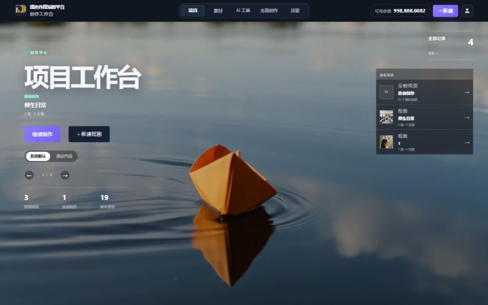
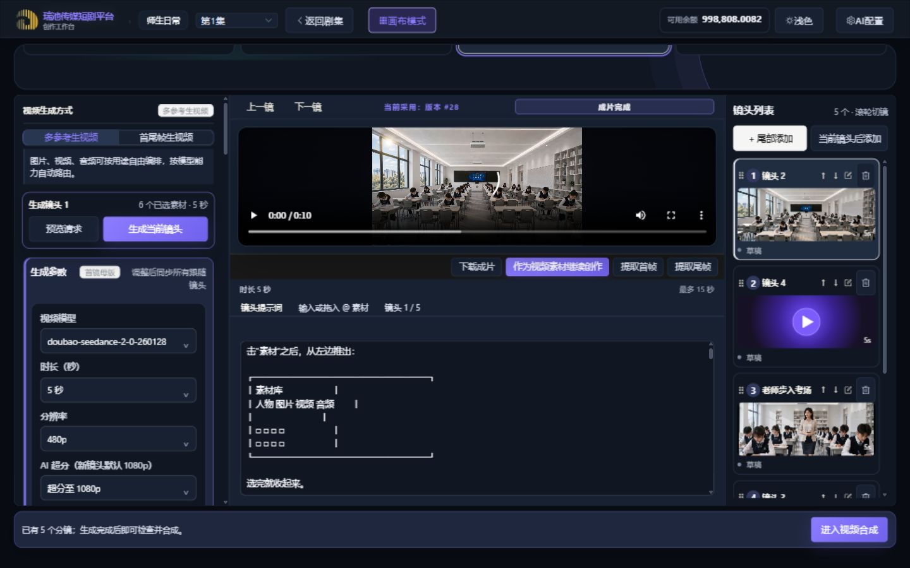
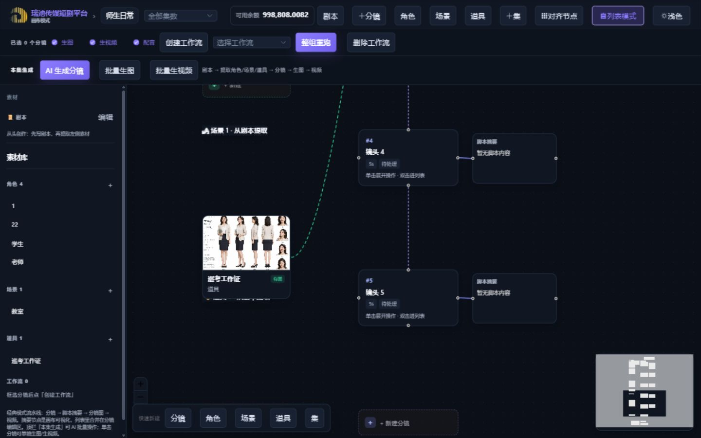

<div align="center">

# RichiDrama

**瑞池传媒 AI 短剧生产平台**

[](LICENSE)
[](#快速开始)
[](#技术架构)

**[线上服务](http://drama.richbest.cn/) · [English](docs/en.md) · [文档索引](docs/README.md) · [部署指南](docs/deployment/README.md)**

</div>

RichiDrama 是可自行部署的 AI 短剧生产平台。

平台覆盖项目、素材、剧本、分镜、图片、视频和成片管理。
部署方管理账号、权限、模型配置、计费数据和媒体存储。

> 本仓库源自 `xuanyustudio/LocalMiniDrama`。
> 当前版本已按瑞池传媒业务流程进行大规模重构。
> 项目保留 MIT 许可证和原始作者署名。

## 主要能力

| 模块 | 能力 |
|------|------|
| 项目生产 | 管理项目、分集、剧本和生产状态 |
| 素材管理 | 管理角色、场景、道具和全局素材 |
| 分镜工作台 | 使用列表或画布编辑分镜和工作流 |
| AI 生成 | 接入文本、图片和视频模型 |
| 视频处理 | 管理分镜视频、配音、字幕和成片合成 |
| 运营管理 | 管理账号、权限、模型价格和计费记录 |
| 私有部署 | 使用 SQLite、持久化媒体目录和 Docker Compose |

## 界面与 UI 审计

以下截图来自 2026-08-20 UI 审计。







完整页面和三档桌面视口证据见 [UI 审计报告](docs/audits/2026-08-20-product-ui-asset-isolation.md#9-截图证据索引)。

## 快速开始

要求：Node.js 18 或更高版本。

```bash
git clone https://github.com/Moemu/RichiDrama.git
cd RichiDrama
```

启动后端：

```bash
cd backend-node
npm install
npm run dev
```

启动前端：

```bash
cd frontweb
npm install
npm run dev
```

打开 `http://127.0.0.1:3013/`。
前端将 `/api` 和 `/static` 代理到后端端口 `5679`。

生产环境使用 Docker Compose：

```bash
docker compose up -d --build
```

配置、数据和部署要求见[快速开始文档](docs/guides/quickstart.md)。

## 技术架构

```text
RichiDrama/
├── backend-node/   # Express、SQLite、媒体和生成任务
├── frontweb/       # Vue 3、Vite、Element Plus 和 Vue Flow
├── deploy/         # 生产部署、备份和恢复脚本
└── docs/           # 使用、架构、设计和集成资料
```

本项目使用 JavaScript。项目不使用 TypeScript 或 monorepo 工具。

## 文档

- [文档索引](docs/README.md)
- [本地开发](docs/guides/quickstart.md)
- [AI 配置](docs/guides/configuration.md)
- [部署与运维](docs/deployment/README.md)
- [架构资料](docs/architecture/README.md)
- [外部集成](docs/integrations/README.md)

## 兼容性说明

重命名不会自动迁移现有生产资源。
以下内部标识暂时保留：

- 服务器目录 `/data/apps/LocalMiniDrama`
- Docker 镜像和容器名 `local-minidrama`
- OSS 前缀 `local-mini-drama`
- 浏览器存储键、拖放类型和内部事件名

这些标识可能关联现有数据或运行中的服务。
后续迁移必须包含备份、回滚和部署验证。

## 贡献与问题

- [报告问题](https://github.com/Moemu/RichiDrama/issues/new)
- [提交 Pull Request](https://github.com/Moemu/RichiDrama/pulls)

## License

[MIT](LICENSE)
