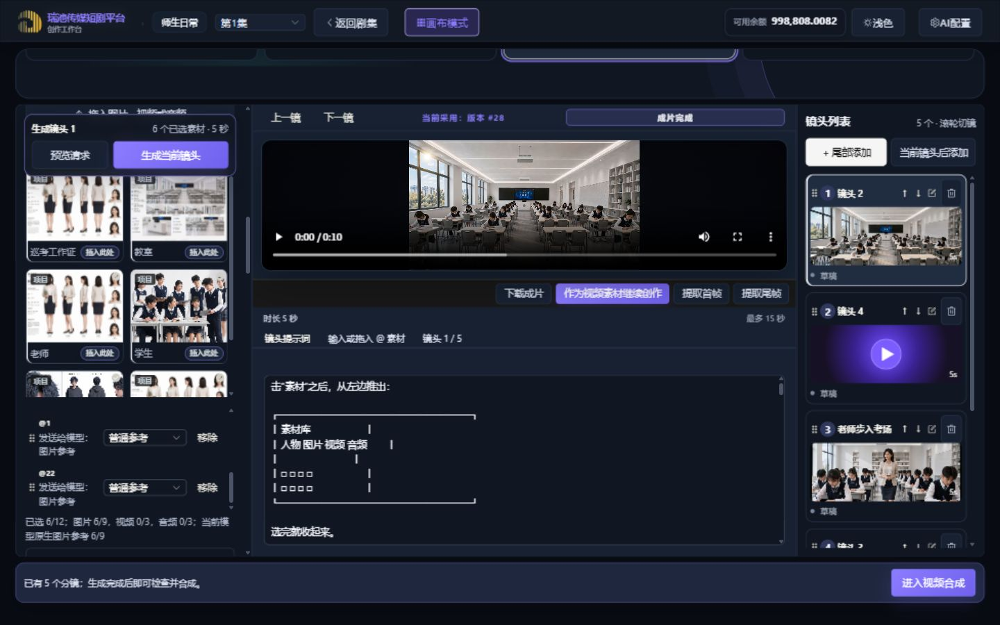
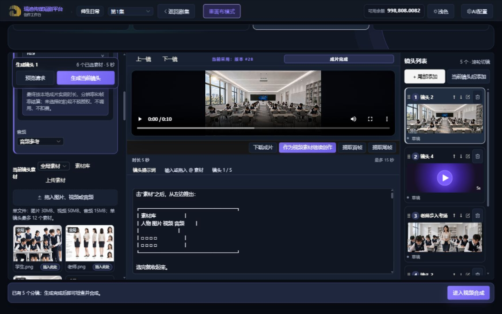
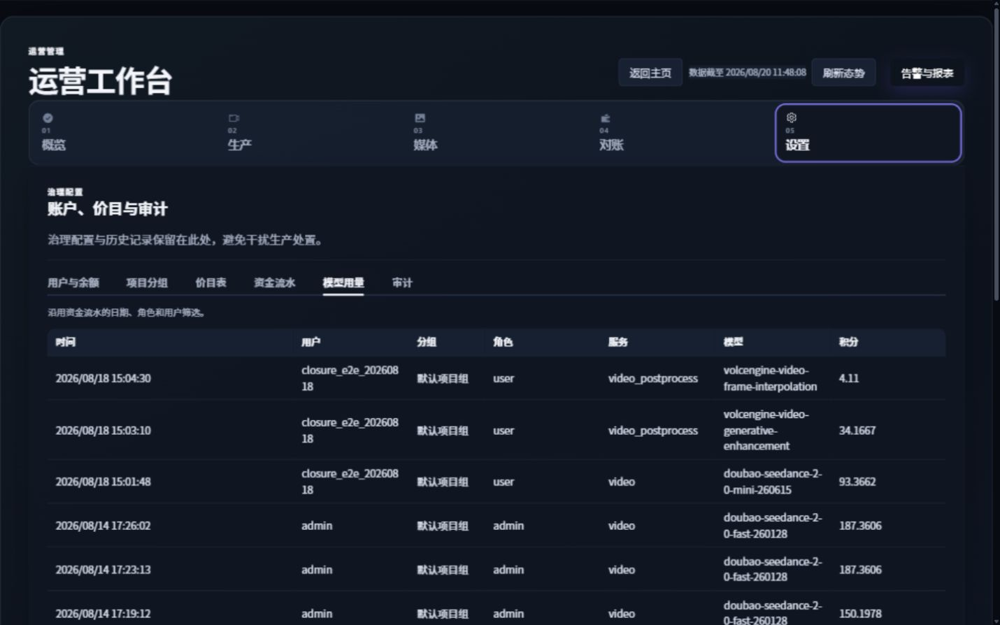

# LocalMiniDrama 产品修改与 UI / 素材隔离审计方案

> 文档日期：2026-08-20（Asia/Shanghai）
> 文档状态：评审稿，可直接用于产品确认、技术拆解与验收
> 本轮范围：需求澄清、现状审计、修改方案、兼容策略、验收标准和本地 UI 截图；不包含业务代码修改
> 审计环境：本地开发环境，未调用任何供应商生成接口，也未触发真实计费

## 1. 结论摘要

本次七项诉求并不是七个互不相关的小功能，核心可以归并为三条产品主线：

1. **账务可解释性**：管理员需要从“用户消耗了多少积分”下钻到“某时间范围内，该用户的每个项目分别消耗多少、由哪些模型和业务动作产生”。
2. **素材边界可理解、可控制**：全局素材、项目素材、本镜已选素材、生成记录必须是四种清晰语义；删除、解除关联、清空选择、隐藏记录也必须拆开，不能共用一个模糊的“删除”。
3. **操作状态可感知**：选中态、作用范围、请求将携带哪些图片、固定区域和滚动边界都要让用户一眼确认，避免“我以为只用了 @1，实际发送了多张图”的不可预期结果。

当前本地工作树已经包含部分尚未交付的改动，因此本文按“当前本地实现”审计，而不把已有代码误判为线上现状。

| 编号 | 诉求 | 当前本地状态 | 结论 / 优先级 |
|---|---|---|---|
| 1 | 管理员积分统计细化到时间、用户、项目 | 已有日期、角色、租户、用户过滤和明细；账单记录缺少稳定的项目快照 | 必须补数据模型与汇总接口，P0 |
| 2 | 项目素材删除；全能制作素材隔离 | 统一资源页已有“删除/解除素材”；项目模式已有项目/全局筛选，但自由模式只能看个人全局素材 | 删除语义和自由模式入口仍需完善，P0/P1 |
| 3 | 分镜已选素材对比度低 | 确认存在；选中与未选中背景、边框相同，仅有 2px 内描边和小勾 | P1，低风险高收益 |
| 4 | `@1` 却融合旧记录，用户想删记录 | 需求本质不是单纯删除历史，而是“控制本次请求输入素材” | 先拆清选择、引用、记录三种状态，P0 |
| 5 | 登录页项目名改为“瑞池传媒短剧平台” | 顶栏、网页标题已是新名称，但主标题仍显示“本地短剧 / 制作平台” | 补齐可见主标题及无障碍文本，P1 |
| 6 | 审计素材隔离方案 | 列表作用域方向合理，但谱系、导入、裁剪、拼接、批量清理存在越权/越界风险 | 必须先修安全边界，P0 |
| 7 | 全模块截图与 UI 审计 | 已覆盖全部主要模块，并实际验收 1280×720、1440×900、1920×1080 | 无页面级横向溢出；字体、嵌套滚动和状态表达需优化 |

## 2. 需求一：管理员积分统计粒度

### 2.1 用户真正需要回答的问题

管理员选择“本月”或任意时间段后，应能回答：

- 平台总计消耗多少积分，按天如何变化；
- 某个用户总计消耗多少；
- 该用户负责的每个项目分别消耗多少；
- 每个项目由图片、视频、文本、模型等业务类型分别产生多少；
- 汇总值能否与逐条计费明细严格对账；
- 无法关联项目的历史流水有多少，为什么无法关联。

### 2.2 当前实现与缺口

当前管理员资金管理已支持日期范围、角色、租户、用户和分页，模型用量表包含时间、用户、租户、角色、服务、模型、积分等字段。后端 `billing_usage_logs` 记录 `user_id`、`tenant_id`、服务、模型、计费数量、引用类型/ID、计费快照和创建时间，但没有稳定的 `drama_id` 与项目名称快照。

因此，现有数据可以按时间和用户汇总，但无法可靠地按项目汇总。事后根据 `reference_id` 猜项目会受删除、改名、任务类型差异和历史数据缺失影响，不应作为长期方案。

### 2.3 推荐的数据模型

在授权时写入业务上下文，并让预授权、交易、用量记录沿同一条链路携带：

| 字段 | 类型 | 说明 |
|---|---|---|
| `drama_id` | nullable integer | 本次计费所属项目；无项目上下文时为空 |
| `project_title_snapshot` | nullable text | 授权当时的项目名称，避免项目改名后历史账单失真 |
| `source_kind` | nullable text | 如 `storyboard`、`omni_sequence`、`video_generation` |
| `source_id` | nullable integer/text | 对应业务记录 ID，用于审计追溯 |
| `business_request_id` | text | 贯穿 HTTP 请求、异步任务、预授权和结算的业务请求 ID |

建议为用量表增加以下索引：

- `(user_id, created_at)`
- `(drama_id, created_at)`
- `(tenant_id, created_at)`
- `(service_type, created_at)`

迁移必须可重复执行、字段可空，并保持所有旧调用方不传新字段时的旧语义。

### 2.4 推荐接口

新增只读汇总接口：

```http
GET /api/v1/admin/usage-summary
```

查询参数建议：

```text
date_from, date_to
quick_range=7d|30d|this_month|last_month|custom
timezone=Asia/Shanghai
user_id, tenant_id, drama_id
service_type, model
group_by=day|user|project|service
page, page_size
```

响应建议分为四部分：

```json
{
  "summary": {},
  "time_series": [],
  "user_project_breakdown": [],
  "unassigned": {},
  "pagination": {}
}
```

- `summary`：总积分、日均、用户数、项目数、调用次数；
- `time_series`：按上海自然日聚合的时间线；
- `user_project_breakdown`：用户 → 项目的可展开树；
- `unassigned`：无法关联项目的历史或全局调用，必须单独展示，不能静默丢弃。

### 2.5 管理端交互方案

模型用量页应拥有自己可见的筛选条，不要依赖用户理解“沿用另一个标签页的筛选”。推荐布局：

1. 第一行：本周、本月、上月、近 30 天、自定义；用户；项目；服务；模型；重置；导出。
2. 第二行：总积分、日均积分、活跃用户数、涉及项目数、未关联项目积分。
3. 第三行：按日时间线图，可切换积分/调用次数。
4. 第四行：用户 → 项目展开表，项目下可继续查看模型和业务类型。
5. 最下方：逐条账单明细，保留请求 ID、计费快照和对账状态。

### 2.6 历史数据兼容

- 发布后新授权记录启用项目快照。
- 历史数据仅对能够通过稳定外键唯一确定项目的记录做只读映射或可审计回填，例如已有 `billing_authorization_id → generation job → drama_id` 的链路。
- 无法唯一确定的记录统一归为“未关联项目（历史）”，仍计入总积分，不进入任何具体项目。
- 禁止按提示词、文件路径、项目同名或当前用户最近项目进行猜测。
- 不批量改写历史账本语义；若未来需要物理回填，必须另行提供范围、备份和回滚方案。

### 2.7 验收标准

- 选择一个月、一个拥有多个项目的用户，可看到每个项目的积分和占比。
- 页面汇总、项目小计、用户小计与逐条 `billing_usage_logs` 精确相等。
- 上海时区 00:00 边界测试通过，服务器运行时区不同不影响结果。
- 项目改名后，旧账单仍显示授权时项目名；详情可跳转当前项目名。
- “未关联项目（历史）”有明确数值和明细入口。
- 筛选、分页、导出使用相同过滤条件，权限仅限管理员。

## 3. 需求二：素材删除与全能制作隔离

### 3.1 先统一四类对象的定义

| 对象 | 含义 | 推荐删除动作 |
|---|---|---|
| 个人全局素材 | 当前用户跨项目复用的素材 | “移至回收站”；不能影响其他用户 |
| 项目素材 | 仅属于当前项目的素材 | “从项目移除”；若是自动映射资源，实质为解除关联并留墓碑 |
| 本镜已选素材 | 下一次生成请求会使用的输入集合 | “取消选择”或“清空本镜素材”，不删除素材文件 |
| 生成记录 | 某次请求、输入快照、结果和计费证据 | “从列表隐藏/移除记录”，不自动删除素材或改变当前选择 |

UI 中不得把以上动作都写成“删除”。确认弹窗必须明确影响范围。

### 3.2 当前本地实现

- 统一资源库已经出现单素材“删除”和项目资源“解除素材”操作。
- 全能制作嵌入项目时，已有“全部 / 项目素材 / 全局素材”筛选，默认项目素材。
- 独立自由制作模式只加载当前用户的全局素材，没有项目选择器，也没有作用域切换。
- 全局媒体库列表固定请求 `scope=global`，单素材有图标删除入口，但按钮缺少可访问名称。

### 3.3 推荐的全能制作规则

独立自由制作模式：

- 默认来源为“我的全局素材”；
- 可切换为“项目素材”；
- 选择“项目素材”后必须先选择一个当前用户有权访问的项目；
- 禁止提供“所有项目素材混在一起”的隐式范围；
- 切换项目时，清空不属于新范围的临时选择，并明确提示。

项目内全能制作模式：

- 默认仅当前项目素材；
- 全局素材作为显式可选来源；
- “全部”只表示“当前项目 + 我的全局”，绝不包含其他项目；
- 请求提交时保存素材 ID 清单和作用域快照，便于历史回看。

### 3.4 删除动作设计

- 项目自动映射资源：按钮名称为“从项目解除”，写入 detached 墓碑，刷新/重启后不得被自动重新导入。
- 手工上传的项目素材：默认软删除；若仍被可编辑分镜引用则阻止并列出引用位置。
- 个人全局素材：只允许素材所有者删除；被项目分镜引用时先提示影响，不应静默断链。
- 生成结果：被采纳为当前镜头版本时，不允许无替代版本直接删除。
- 批量清理：请求必须携带明确 `scope`；后端必须再次校验，不能根据当前前端页面推断。

### 3.5 已发现的高风险问题

全局媒体库界面只展示全局素材，但“一键清空素材库”的后端批量删除路径目前按所有者范围匹配，未限定 `scope=global`。这可能把该用户的项目素材也一并软删除，属于 P0 语义越界。

同时，批量删除项目资源时没有复用单条删除的 detached 墓碑逻辑，重启或重新同步后存在资源被自动恢复的可能。必须让单条与批量路径使用同一领域服务和相同事务语义。

## 4. 需求三：分镜素材选中态

### 4.1 现状证据

实际样式计算结果：

| 状态 | 背景 | 边框 | 额外提示 |
|---|---|---|---|
| 未选中 | `rgb(16, 23, 34)` | `rgb(38, 51, 73)` | 无 |
| 已选中 | `rgb(16, 23, 34)` | `rgb(38, 51, 73)` | 仅 2px 左侧浅色内描边和小勾 |

也就是说，选中与未选中的主体背景和边框完全相同，用户的反馈成立。

### 4.2 修改方案

- 已选卡片使用 2px 品牌强调色完整边框，不只使用左侧内描边。
- 叠加 8%–12% 的强调色背景或蒙层，同时保留缩略图可辨识度。
- 右上角使用至少 22×22px 的高对比勾选徽标，并增加“已选”文字。
- 左栏标题显示“本次已选 N 张”，素材卡添加 `aria-pressed` 或复选框语义。
- 悬停、键盘焦点、已选三种状态必须不同；非文字状态指示与相邻颜色对比至少 3:1。
- 提交前再次显示“本次将发送 N 张素材”，避免仅靠颜色承担关键含义。

### 4.3 验收标准

- 1280、1440、1920 三档分辨率下，不滚动也能辨认首屏选中项。
- 灰度截图、低亮度显示器和色觉异常模拟下仍能依靠边框、图标、文字辨认。
- 鼠标点击、键盘操作、刷新恢复后的选中数量一致。

## 5. 需求四：`@1` 融合旧记录，为什么用户想删记录

### 5.1 需求的准确解释

用户说“我 @1 图，他会融合以前的记录，两张图融在一起，所以想把记录删了”，很可能是在表达：

> 我只想让下一次生成使用提示词中显式 `@` 的那张图片，但系统仍把这个镜头以前选中过、刷新后恢复的其他素材一起作为输入发送；用户把“已选素材状态”误认为“生成记录”，因此认为删除记录能阻止继续融合。

当前调用链会优先排列提示词中显式 `@` 的素材，但不会自动排除其他已选素材。若本镜仍保存多张素材，`@1` 是“绑定/优先”，不是“仅使用 @1”。因此这不是一个单纯增加历史删除按钮就能解决的问题。

### 5.2 必须拆开的三个概念

1. **本镜素材**：下一次请求会发送的实时输入集合。
2. **提示词 `@` 引用**：在集合中绑定或优先某张素材。
3. **生成记录**：已经发生的请求及其输入、结果和计费快照。

删除生成记录不应改变本镜素材；取消本镜素材也不应删除历史审计记录。

### 5.3 推荐交互

- 素材区提供单项取消和“清空本镜素材”。
- 生成按钮附近显示预检摘要：`本次将发送 2 张：人物参考图、场景参考图`。
- 提供明确策略开关：
  - `发送全部已选素材`；
  - `仅发送提示词中 @ 的素材`。
- 对存量镜头保持“发送全部已选素材”的旧语义，避免静默改变历史工作流。
- 新建镜头是否默认“仅发送 @ 素材”应作为产品开关发布；推荐先显式提示一次，再记录用户偏好。
- 历史列表提供“从列表移除记录”，采用软隐藏/墓碑；保留请求快照、账单和审计数据。
- 若用户希望复用旧输入，使用“从记录恢复提示词与素材”，不要通过隐式状态恢复。

推荐确认文案：

> 移除记录只会把该次生成从当前列表隐藏，不会删除素材，也不会改变本镜已选素材。要停止下一次继续使用图片，请在“本镜素材”中取消选择。

## 6. 需求五：登录页项目名称

当前顶栏品牌名、浏览器标题和路由标题已经是“瑞池传媒短剧平台”，但登录页主视觉标题仍显示“本地短剧 / 制作平台”。这会让用户认为改名未完成。

修改范围应包括：

- 登录页 H1 主标题改为完整名称“瑞池传媒短剧平台”；
- 同步检查 `aria-label`、页面描述、图片替代文本和登录页相关测试；
- 顶栏可继续显示相同品牌名，避免登录前后命名不一致；
- 不修改业务 API 名称、数据库名称和已有项目数据。

## 7. 需求六：素材隔离方案审计

### 7.1 方向上合理的部分

- 项目作用域列表使用严格 `drama_id`；全局作用域使用 `drama_id IS NULL + owner_user_id`。
- 项目资源映射使用独立关联表，并为“用户主动解除”保留 detached 状态，能够阻止刷新后自动重建。
- 全能视频解析素材时会校验素材所有者或项目所有者。
- 项目模式把“当前项目”和“我的全局”分开，产品语义正确。

### 7.2 必须修复的边界

| 风险 | 当前问题 | 后果 | 建议 |
|---|---|---|---|
| 谱系查询 | `getLineage(id)` 未携带当前用户，祖先/后代遍历也无所有权边界 | 可通过 ID 查看他人素材关系 | 所有节点逐级 owner/project 授权，越界即 404 |
| 图片/视频导入 | 部分按 ID 导入路径未先校验当前用户 | 跨账号读取或创建副本 | 路由进入服务时统一使用 `getOwnedAsset` |
| 裁剪/拼接 | 源素材使用无作用域的 `getById` | 可用他人素材执行处理 | 输入列表逐项授权，输出继承明确 owner/scope |
| 批量清理 | `all_matching` 未强制 scope | 全局页可能误删项目素材 | scope 必填且后端白名单校验 |
| 解除一致性 | 批量删除没有统一写 detached 墓碑 | 自动映射资源可能复活 | 单条和批量复用同一事务服务 |
| 映射素材 owner | 自动创建的项目素材可能缺 `owner_user_id` | 查询、审计和迁移语义含糊 | 新记录同步项目 owner；旧空值只做安全、可审计回填 |
| 引用检查 | 可编辑分镜引用扫描未充分限定所有权 | 外部异常引用可能阻断当前用户 | 引用写入和阻断检查同时限定 owner/project |

### 7.3 推荐的不变量

每条素材必须明确具备：

```text
owner_user_id
scope_type = global | project
drama_id = null | project id
deleted_at
```

- `global` 必须是“当前用户的个人全局”，不等于全平台共享，也不等于租户共享。
- `project` 必须有 `drama_id`，且项目所有者/成员权限可验证。
- 若未来需要团队素材，应新增显式 `tenant` 作用域，不能复用 `drama_id IS NULL`。
- 列表、详情、更新、删除、谱系、导入、裁剪、拼接、批量操作全部走同一所有权策略。
- 完成态图片/视频只引用本地持久化路径；供应商签名 URL 不得成为素材库长期来源。

### 7.4 必测矩阵

- 用户 A / B、项目 A1 / A2 / B1、个人全局素材分别创建同内容素材。
- 覆盖 list、get、update、delete、lineage、trim、concat、import、batch-delete。
- 同 checksum 不得造成跨用户或跨项目串联。
- detached 项目资源刷新、后端重启后不得自动重建。
- 已完成历史生成在素材解除后仍可读取审计快照，且不会重复扣费或重复提交。
- 每条 API 的越权响应不泄露资源是否存在，统一采用 404 或既定安全策略。

## 8. 需求七：全模块 UI 与交互审计

### 8.1 视口验收结果

关键页面已实际检查 1280×720、1440×900、1920×1080：项目列表、自由制作、全局媒体库、AI 工具、统一资源、分镜工作台、管理员模型用量。

| 检查项 | 结果 |
|---|---|
| 页面级横向溢出 | 三档视口均未发现 body 横向溢出 |
| 管理端纵向滚动 | 可达；1280 下页面高度约 2157px，1440 下约 1479px |
| 表格横向滚动 | 主要归属局部容器，没有阻断页面纵向滚动 |
| 分镜最后操作项 | 左、中、右区域可分别滚动到达；底部操作栏持续可见 |
| 固定/粘性遮挡 | 未发现长期遮挡；分镜草稿恢复 toast 会短时遮住顶部工作流 |
| 大屏利用率 | 1920 下多页仍限制在约 1440 内容宽度，字体未随空间改善 |

### 8.2 跨页面共性问题

#### 字体与信息层级

- 多数辅助文字、表格、工具栏和卡片说明落在约 12–13px，深色背景下阅读负担明显。
- 推荐正文与表格主体至少 14px，关键数据 15–16px，标签与辅助说明最低 12px；行高不低于 1.45。
- 1920 宽屏不应只是增加两侧留白，可适度扩大管理表格、历史栏和素材缩略图。

#### 固定布局与嵌套滚动

- 项目详情、统一资源、分镜工作台大量使用内部滚动。功能可达，但用户不易发现哪个区域还能滚动。
- 为可滚动容器提供稳定滚动条、底部渐隐提示或“还有 N 项”的状态；避免同一区域同时存在纵向和横向滚动。
- 窄屏下优先保留主任务区，左右面板应支持折叠，不应仅压缩文字。

#### 背景与对比度

- 项目列表和 AI 工具的电影化背景有品牌感，但亮部会与文字竞争。
- 推荐在信息密集区域增加局部渐变遮罩或实体表面层，保持装饰区域透明度。
- 不建议删除整体视觉风格；问题集中在可读性和操作层级，而不是风格方向。

#### 操作反馈

- 删除图标、素材卡选择和只读/可编辑状态需要文字或无障碍名称，不能只靠小图标。
- 草稿恢复 toast 不应遮挡当前步骤标题；可移到右下角或缩短占用宽度。
- 长耗时任务应展示状态、刷新方式和可恢复性，不能在 HTTP handler 内长轮询供应商。

### 8.3 分模块结论

| 模块 | 主要发现 | 建议优先级 |
|---|---|---|
| 登录页 | 视觉完成度高；主标题仍是旧名称 | P1 |
| 项目列表 | 氛围好；背景亮部影响文字，对近期项目的弱文字不友好 | P2 |
| 项目详情 | 双栏清晰；内容区出现嵌套滚动 | P2 |
| 项目资源 | 空状态面积过大，“资源库/制作资源”命名重复，行动入口弱 | P2 |
| 主工作流 | 信息结构完整；辅助文字密度高且偏小 | P2 |
| 统一资源 | 三列作用域清楚；横向滚动和操作字过小 | P1/P2 |
| 分镜工作台 | 核心链路可用；已选态不清楚，三列滚动认知成本高 | P1 |
| 自由制作 | 风格统一；缺项目素材入口和项目上下文 | P1 |
| 全局媒体库 | 卡片清楚；删除按钮缺可访问名称，批量清理范围危险 | P0/P1 |
| 管理员控制台 | 数据丰富；缺直接用户搜索和层级收敛 | P1 |
| 模型用量 | 明细具备；项目维度缺失，筛选可发现性不足 | P0 |
| 账户中心 | 信息结构稳定，可保持 | P3 |
| 运营报表 | 图表与表格可用；表格正文字号偏小 | P2 |
| AI 配置 | 表格过密、长 URL/模型名裁切；本地历史数据存在乱码显示 | P1 |
| AI 工具首页 | 电影感强；左侧装饰占比大，右侧说明文字过小 | P2 |
| 剧本分析/续写 | 功能入口明确；大面积留白和辅助字偏小 | P2 |
| 剧本创作 | 表单清楚；可提升标签与输入说明字号 | P2 |
| 反推提示词 | 上传区清楚；历史/说明层级偏弱 | P2 |
| 图片生成 | 历史栏窄，长文本和失败/占位结果表达不足 | P1 |
| 视频生成 | 操作完整；提示词与历史信息密集、字号偏小 | P2 |
| 画布 | 节点操作可用；工具栏过密，缩略图在暗色页面上视觉过强 | P1/P2 |
| 视频拼接 | 布局平衡；辅助说明可提升到 13–14px | P2 |
| 项目设置 | 表单过度收窄，下方空白巨大 | P2 |

本地 AI 配置和图片结果中观察到 `?` 形式的历史乱码。应先确认数据编码和历史写入来源；若需修复历史显示，采用显式、可审计迁移，禁止按当前显示内容批量猜测重写。

## 9. 截图证据索引

截图目录：[`docs/assets/ui-audit-20260820`](./assets/ui-audit-20260820/)

### 9.1 全模块 1440×900

| 模块 | 截图 |
|---|---|
| 登录页 | [01-login-1440x900.png](./assets/ui-audit-20260820/01-login-1440x900.png) |
| 项目列表 | [02-project-list-1440x900.png](./assets/ui-audit-20260820/02-project-list-1440x900.png) |
| 全局媒体库 | [03-media-library-1440x900-viewport.png](./assets/ui-audit-20260820/03-media-library-1440x900-viewport.png) |
| 自由制作 | [04-free-create-1440x900.png](./assets/ui-audit-20260820/04-free-create-1440x900.png) |
| 项目详情 | [05-project-detail-1440x900.png](./assets/ui-audit-20260820/05-project-detail-1440x900.png) |
| 项目资源 | [06-project-resources-1440x900.png](./assets/ui-audit-20260820/06-project-resources-1440x900.png) |
| 主工作流 | [07-main-workflow-1440x900.png](./assets/ui-audit-20260820/07-main-workflow-1440x900.png) |
| 统一资源 | [08-unified-assets-1440x900.png](./assets/ui-audit-20260820/08-unified-assets-1440x900.png) |
| 分镜工作台 | [09-storyboard-workbench-1440x900.png](./assets/ui-audit-20260820/09-storyboard-workbench-1440x900.png) |
| 分镜已选素材 | [10-storyboard-selected-assets-1440x900.png](./assets/ui-audit-20260820/10-storyboard-selected-assets-1440x900.png) |
| 分镜全局素材 | [11-storyboard-global-assets-1440x900.png](./assets/ui-audit-20260820/11-storyboard-global-assets-1440x900.png) |
| 管理员控制台 | [12-admin-console-1440x900.png](./assets/ui-audit-20260820/12-admin-console-1440x900.png) |
| 管理设置 | [13-admin-settings-1440x900.png](./assets/ui-audit-20260820/13-admin-settings-1440x900.png) |
| 模型用量 | [14-admin-model-usage-1440x900.png](./assets/ui-audit-20260820/14-admin-model-usage-1440x900.png) |
| 账户中心 | [15-account-center-1440x900.png](./assets/ui-audit-20260820/15-account-center-1440x900.png) |
| 运营报表 | [16-operations-reports-1440x900.png](./assets/ui-audit-20260820/16-operations-reports-1440x900.png) |
| AI 配置 | [17-ai-config-1440x900.png](./assets/ui-audit-20260820/17-ai-config-1440x900.png) |
| AI 工具首页 | [18-ai-tools-1440x900.png](./assets/ui-audit-20260820/18-ai-tools-1440x900.png) |
| 剧本分析 | [19-script-analysis-1440x900.png](./assets/ui-audit-20260820/19-script-analysis-1440x900.png) |
| 剧本续写 | [20-script-analysis-stream-1440x900.png](./assets/ui-audit-20260820/20-script-analysis-stream-1440x900.png) |
| 剧本创作 | [21-script-writing-1440x900.png](./assets/ui-audit-20260820/21-script-writing-1440x900.png) |
| 反推提示词 | [22-reverse-prompt-1440x900.png](./assets/ui-audit-20260820/22-reverse-prompt-1440x900.png) |
| 图片生成 | [23-image-generation-1440x900.png](./assets/ui-audit-20260820/23-image-generation-1440x900.png) |
| 视频生成 | [24-video-generation-1440x900.png](./assets/ui-audit-20260820/24-video-generation-1440x900.png) |
| 画布 | [25-canvas-loaded-1440x900.png](./assets/ui-audit-20260820/25-canvas-loaded-1440x900.png) |
| 视频拼接 | [26-video-merge-1440x900.png](./assets/ui-audit-20260820/26-video-merge-1440x900.png) |
| 项目设置 | [27-project-settings-1440x900.png](./assets/ui-audit-20260820/27-project-settings-1440x900.png) |

### 9.2 三档桌面视口

| 页面 | 1280×720 | 1440×900 | 1920×1080 |
|---|---|---|---|
| 项目列表 | [28](./assets/ui-audit-20260820/28-project-list-1280x720.png) | [02](./assets/ui-audit-20260820/02-project-list-1440x900.png) | [35](./assets/ui-audit-20260820/35-project-list-1920x1080.png) |
| 自由制作 | [29](./assets/ui-audit-20260820/29-free-create-1280x720.png) | [04](./assets/ui-audit-20260820/04-free-create-1440x900.png) | [36](./assets/ui-audit-20260820/36-free-create-1920x1080.png) |
| 全局媒体库 | [30](./assets/ui-audit-20260820/30-media-library-1280x720.png) | [03](./assets/ui-audit-20260820/03-media-library-1440x900-viewport.png) | [37](./assets/ui-audit-20260820/37-media-library-1920x1080.png) |
| AI 工具 | [31](./assets/ui-audit-20260820/31-ai-tools-1280x720.png) | [18](./assets/ui-audit-20260820/18-ai-tools-1440x900.png) | [38](./assets/ui-audit-20260820/38-ai-tools-1920x1080.png) |
| 统一资源 | [32](./assets/ui-audit-20260820/32-unified-assets-1280x720.png) | [08](./assets/ui-audit-20260820/08-unified-assets-1440x900.png) | [39](./assets/ui-audit-20260820/39-unified-assets-1920x1080.png) |
| 分镜工作台 | [33](./assets/ui-audit-20260820/33-storyboard-1280x720.png) | [09](./assets/ui-audit-20260820/09-storyboard-workbench-1440x900.png) | [40](./assets/ui-audit-20260820/40-storyboard-1920x1080.png) |
| 模型用量 | [34](./assets/ui-audit-20260820/34-admin-usage-1280x720.png) | [14](./assets/ui-audit-20260820/14-admin-model-usage-1440x900.png) | [41](./assets/ui-audit-20260820/41-admin-usage-1920x1080.png) |

### 9.3 关键问题对比

选中素材状态：



未选素材状态：



管理员模型用量现状：



## 10. 影响面检索结果

本次已在 `frontweb/src`、`backend-node/src`、`backend-node/test` 检索素材作用域、项目 ID、生成记录、计费引用、选择状态及其消费者。

前端主要消费者：

- 全局媒体库、项目资源、统一资源库；
- `FreeCreate`、`FilmCreate`、素材选择器和工具工作台；
- 分镜工作台、图片生成、视频生成、画布；
- 管理员资金、模型用量和报表页面。

后端主要消费者：

- assets 路由与 `assetService`；
- `assetMappingService`、分镜服务、Omni 视频/序列服务；
- 图片/视频导入、裁剪、拼接、媒体持久化；
- billing/admin 路由、预授权、结算、用量与账本服务。

现有测试消费者包括素材服务、生成设置、Omni 提示词引用、租户/权限等测试。实施时必须新增上述隔离矩阵的 HTTP 集成测试，并补充 detached 与账单项目快照的重启恢复测试。

## 11. 推荐实施顺序

### 阶段 A：先封安全与语义漏洞（P0）

1. 修复谱系、导入、裁剪、拼接、批量清理的所有权和作用域校验。
2. 统一单条/批量解除的 detached 事务语义。
3. 拆分“本镜素材、@ 引用、生成记录”，加入请求前素材摘要。
4. 为新计费记录写入项目快照和业务请求 ID。

### 阶段 B：完成用户可见功能（P1）

1. 上线管理员时间线和用户 → 项目积分下钻。
2. 自由制作加入项目选择和来源切换。
3. 提升分镜素材选中态；补清空本镜素材和生成记录软隐藏。
4. 统一登录页品牌名称。
5. 修复图标按钮无障碍名称和模型用量筛选可发现性。

### 阶段 C：统一 UI 可读性（P2）

1. 建立 12/14/16px 文本层级和深色主题对比度 token。
2. 优化统一资源、分镜、项目详情的嵌套滚动提示和面板折叠。
3. 改善 1920 大屏利用率、AI 工具信息密度、项目设置空白。
4. 清理历史乱码的来源，并在明确授权后做可审计修复。

## 12. 发布与回归门槛

- 数据库迁移可重复执行，新增列可空且有安全默认；旧 API 请求不传新字段仍保持原语义。
- 新行为仅作用于发布后创建/显式选择的新记录；存量镜头保持原素材发送策略。
- 历史账单不被猜测归项目；未关联项仍计入平台与用户总数。
- 全部素材 API 通过双用户、跨项目、全局/项目矩阵测试。
- 后端相关测试、前端自动化测试和 production build 全部通过。
- 使用内置浏览器再次验收 1280×720、1440×900、1920×1080，重点检查滚动、窄屏、固定区、遮挡、最后一项可达和主要用户路径。
- 至少验证一条历史账单、一条 detached 项目资源和一个处理中任务在后端重启后仍按原语义读取。
- 不为 UI 验收调用真实供应商；需要验证真实生成时只允许通过项目 `/api/v1/...` 路由、登录态和业务请求 ID 进入完整计费闭环。
- 若任务包含提交与部署，必须以目标远端提交的部署工作流成功为完成条件，再确认部署环境运行目标提交和受影响页面健康。

## 13. 需要产品确认的最终决策

本文给出推荐默认值，进入开发前只需确认以下三点：

1. 新建镜头是否默认“仅发送 @ 素材”；推荐先保持显式开关并记录用户偏好，存量镜头绝不静默切换。
2. “删除生成记录”是否采用仅当前用户可见的软隐藏；推荐是，账单和请求快照永久保留审计可见性。
3. 团队是否需要共享素材；当前建议只支持“个人全局 + 当前项目”，未来如需共享应新增 tenant scope，不复用个人全局。

确认以上决策后，可以按阶段 A → B → C 直接拆分开发任务。

## 14. 实施闭环记录（2026-08-20）

本方案已按推荐默认值实施，并以“新请求启用、历史数据保持原语义”为兼容边界：

| 需求 | 已实施结果 |
|---|---|
| 管理员积分统计 | 新账单在预授权与结算时固化项目 ID、项目名称和业务来源快照；模型用量页提供日期快捷筛选、Shanghai 日时间线、用户 → 项目消耗表和明细项目列。历史账单默认显示“未关联项目（历史/全局）”；管理员可执行审计化回填，且只处理能由授权 ID 一对一验证到仍存在项目的记录。 |
| 素材隔离与删除 | 个人全局素材只属于本人；项目素材必须属于当前用户拥有的项目。单条/批量删除按明确 `global` 或 `project` 范围处理；项目资源删除写入 detached tombstone，不会被同步任务重建。 |
| 分镜素材与 @ | 分镜选中态使用高对比边框、遮罩、勾选和“已选”文字；可显式清空本镜选择。新增“全部已选素材 / 仅提示词 @ 素材”发送策略，生成请求仅发送策略选定素材。 |
| 生成记录 | 完成态生成记录支持“隐藏记录”：只从当前镜头历史隐藏，不删除视频、账本、请求快照或已采用成片；处理中任务不能隐藏。 |
| 登录品牌 | 登录入口统一为“瑞池传媒短剧平台”。 |
| 验证 | 后端全量测试、前端全量测试、前端 production build 均通过；后端已重启并完成迁移恢复验证。内置浏览器验证了登录、素材库、全能分镜和模型用量页的主要路径及 1280×720 布局。既有审计截图覆盖 1280×720、1440×900、1920×1080 三档页面基线。 |

除下述 14.2 的管理员低成本验收外，本轮未触发任何真实供应商生成或计费调用，也未对历史账本、历史媒体或生产数据执行破坏性迁移。

### 14.1 历史项目归属回填结果

管理员已于 2026-08-20 执行一次安全回填：2 条用量记录和 4 条关联账本流水被归属到项目“1”，共 269.1233 积分；17 条无法经授权 ID 一对一验证的历史记录仍保持“未关联项目（历史/全局）”。回填操作已写入 `billing.project_snapshot.backfill` 审计日志。

#### 生产发布与回填边界

生产环境**不在服务启动或数据库迁移时自动回填项目归属**。发布后，新产生的预授权、结算和用量记录会直接写入项目快照；如需整理历史“未关联项目（历史/全局）”记录，由管理员在模型用量页显式确认并填写原因后发起回填。

- 回填必须携带幂等键；同一管理员以同一幂等键重复提交会复用首个结果，不会再次更新账本或新增审计记录。
- 回填只更新 `drama_id IS NULL` 且可由授权 ID 唯一验证到现存、同一所有者项目的记录；二义、已删除项目及全局创作历史保持原样。
- 建议先在生产只读查看“未关联项目”总额，再按一次发布批次使用一个幂等键执行；保留返回的统计和审计日志，若需再次处理则使用新的幂等键和新的审批原因。

### 14.2 管理员真实低成本调用验收

管理员创建项目“计费归属验收-2026-08-20T05-54-14-413Z”（ID 15），并仅通过带登录态的项目 API `POST /api/v1/generation/story` 发起一集真实文本生成，模型为 `doubao-seed-2-0-lite-260428`。异步任务已完成；供应商真实用量结算为 0.5355 积分。

- 预授权、结算流水、用量日志均固化为项目 15 的项目名称快照，来源为 `story_generation`；
- 管理员用量汇总在当日显示该项目 1 次调用、0.5355 积分，且不计入未关联项目；
- 项目文本自动计费已通过请求上下文传递 `drama_id`，异步故事任务显式保持该上下文；
- 图片、普通视频、全能视频已在其预授权入口传递项目快照；视频超分、插帧和分镜 TTS 已补齐从所属视频/分镜继承项目快照。未在没有额外预算上限的情况下发起图片、视频或后处理真实供应商调用。

### 14.3 素材选择与发送范围文案复核

素材选中状态仅使用高对比亮青色双边框和外发光，不再用“已选”角标或勾选图标覆盖缩略图。发送范围仍保留为必要控制项：它决定实际随本次请求发送给模型的素材，避免已选素材被无意全部提交。界面文案改为“本次发送给模型的素材”，选项为“发送全部已选 / 只发送提示词中的 @ 素材”，删除了与当前操作无关的生成记录说明。
