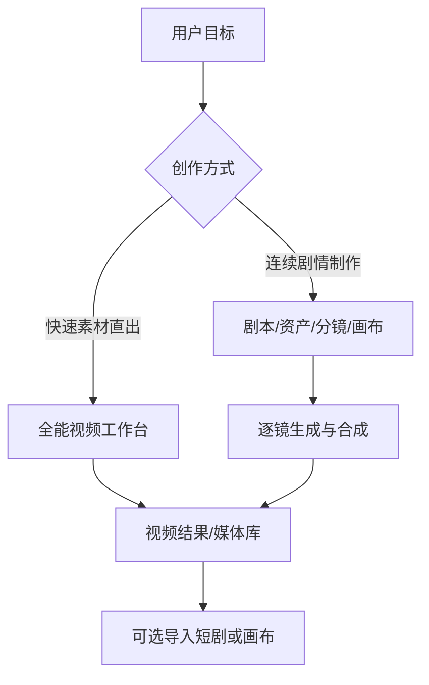

# 全能素材直出视频：功能修正文档

> 文档状态：待评审  
> 日期：2026-07-29  
> 目标版本：MVP（P0）→ 增强版（P1）  
> 适用范围：LocalMiniDrama Web / Desktop，保留现有短剧生产流，不替代它。

## 1. 修正结论

将当前“自由创作”升级为**全能素材视频工作台**：用户无需先建立剧本、角色、场景或分镜，只需上传/选择图片、视频、音频素材，编写全能提示词，即可提交视频生成任务。

角色、场景、道具不再是视频生成的前置条件，而是可选的素材来源和快捷标签。短剧项目、分镜、画布模式继续服务于长链路叙事创作；全能工作台服务于快速、自由、非结构化的视频创作。两个入口共用素材、模型、任务、成片和下载能力。

核心流程如下：

```mermaid
flowchart LR
    A[上传或选择素材] --> B[素材编排：指定用途]
    B --> C[全能提示词：@素材引用]
    C --> D[模型能力匹配与请求校验]
    D --> E[异步视频生成]
    E --> F[预览、下载、保存到素材库]
    F --> G[可选：进入短剧/画布继续编辑]
```

## 2. 背景与问题

对标产品的关键体验不是“预先配置角色和场景”，而是让用户将已有的视觉、视频、声音资产与自然语言意图一次性编排后直接生成。当前项目已具备相当多的底层能力，但产品入口和数据组织仍将用户引导到“先做短剧资产，再做分镜视频”的路径，导致自由度被感知为较低。

当前可复用基础与缺口：

| 能力 | 当前状态 | 修正方向 |
| --- | --- | --- |
| 自由入口 | 已有 `/free-create`，只支持文字和单张参考图；首页入口目前被注释隐藏 | 升级为独立主入口“全能视频”，在首页与导航显式开放 |
| 视频任务 | `POST /videos`、异步任务、轮询、结果本地化已可用 | 扩展为可携带素材清单、素材角色、可解释的模型路由 |
| 图片参考 | 视频记录已有 `reference_image_urls`，现有服务可传多图；Seedance 全能调用最多取 9 张 | 前端提供多图拖拽、排序、@引用与角色标注；上限由模型能力配置决定 |
| 音频参考 | Seedance 2 全能调用已有 `reference_audio` 注入逻辑，但入口来自角色音色 | 将其泛化为工作台的音频素材；同时区分“供模型参考”和“成片配乐” |
| 视频素材 | 媒体库界面允许选择视频，但实际上传 API 只允许图片，素材没有真正入库 | 新增通用媒体上传与视频适配器；模型不支持视频入参时提供明确降级方案 |
| 素材库 | `assets`、角色/场景/道具全局库、生成结果导入均已存在 | 统一为可被工作台选择的媒体资产，并增加来源、元数据、缩略图、标签、用途 |
| 短剧流 | 剧本→资产→分镜→视频链路完善 | 保持不变；增加“从工作台结果新建素材/导入项目”的桥接 |

代码依据（本次仅产出方案，未改动业务代码）：

- [自由创作页面](/C:/Users/EDY/Desktop/项目工作流文档/LocalMiniDrama/frontweb/src/views/FreeCreate.vue) 已调用 `/videos`，但只有一张 `first_frame_url`。
- [视频路由](/C:/Users/EDY/Desktop/项目工作流文档/LocalMiniDrama/backend-node/src/routes/videos.js) 已保存首尾帧及 `reference_image_urls`。
- [视频服务](/C:/Users/EDY/Desktop/项目工作流文档/LocalMiniDrama/backend-node/src/services/videoService.js) 已会读取多图并发给 `videoClient`。
- [视频客户端](/C:/Users/EDY/Desktop/项目工作流文档/LocalMiniDrama/backend-node/src/services/videoClient.js) 已具备 Seedance 全能多图和 `reference_audio` 请求结构。
- [上传路由](/C:/Users/EDY/Desktop/项目工作流文档/LocalMiniDrama/backend-node/src/routes/upload.js) 当前仅实现图片上传，以及仅供角色音色使用的音频上传。
- [媒体素材库](/C:/Users/EDY/Desktop/项目工作流文档/LocalMiniDrama/frontweb/src/views/MediaLibrary.vue) 与 [资产服务](/C:/Users/EDY/Desktop/项目工作流文档/LocalMiniDrama/backend-node/src/services/assetService.js) 尚未将直接上传文件创建为 `assets` 记录。

## 3. 产品定位与边界

### 3.1 新入口

页面名称建议为“全能视频”，路由可保留 `/free-create` 以兼容旧链接，页面标题与导航文案改为“全能视频”。首屏文案：

> 上传图片、视频或音频素材，输入提示词，即可快速生成视频。角色、场景和道具均为可选参考，不是限制条件。

用户可以从以下任一位置进入：

1. 首页顶部主操作“全能视频”。
2. 媒体素材库的“用选中素材创作”。
3. 短剧/画布中任意图片、视频、音频结果的“在全能视频中使用”。

### 3.2 必须坚持的原则

1. **零结构化前置**：不要求 `drama_id`、`storyboard_id`、角色、场景、道具或剧本。
2. **素材是平等输入**：上传素材、媒体库素材、短剧资产、生成结果均使用同一素材卡片模型。
3. **模型能力优先**：不向不支持某类输入的供应商伪造请求；提交前展示实际可用模式及降级结果。
4. **提示词拥有最终创作权**：素材角色只表达“如何参考”，不自动将素材解释为角色或场景。
5. **任务可复现**：每个结果必须保存当时的提示词、素材快照、顺序、模型、参数、路由决策和最终请求摘要。
6. **不破坏短剧流**：短剧原有的剧本、资产、分镜约束仅在对应页面生效，不能反向污染工作台。

### 3.3 非目标

- P0 不承诺所有视频模型都能接受“视频文件作为原始输入”。该能力必须取决于目标模型/API。
- P0 不将任意音频自动理解为可生成口型的对白。是否驱动声音、是否作为音色参考、是否仅在后期混音，必须由模型能力和用户用途共同决定。
- P0 不重做专业时间线剪辑器；只提供生成前素材编排和生成后轻量处理入口。

## 4. 用户流程与页面设计

### 4.1 单页工作台布局

建议沿用对标产品“三栏”思路，但避免把分镜列表作为前置：

```text
┌──────────────┬──────────────────────────────┬──────────────────────┐
│ 素材池       │ 全能创作区                   │ 任务与历史           │
│ 上传/素材库  │ 提示词（支持 @素材）         │ 当前任务进度         │
│ 图片/视频/音频│ 预览画布                     │ 生成结果卡片         │
│ 拖入编排区   │ 参数：模型/比例/时长/清晰度  │ 复用/下载/入库       │
│              │ 生成视频                     │ 失败原因与重试       │
└──────────────┴──────────────────────────────┴──────────────────────┘
```

移动端或窄屏收为三个抽屉/标签页：素材、创作、历史；“生成视频”始终固定在底部。

### 4.2 素材池

素材池支持本地上传、拖放、粘贴和从媒体库选择；素材卡片统一显示缩略图/波形、文件名、类型、时长或尺寸、来源与状态。

素材进入“本次创作”后，用户可以设置用途。用途是建议和模型路由依据，不是内容限制：

| 类型 | 可选用途 | 说明 |
| --- | --- | --- |
| 图片 | 主视觉、人物一致性、场景/风格、道具细节、首帧、尾帧、普通参考 | 同一图片可被多个提示词引用，但单次请求中同一素材只发送一次 |
| 视频 | 动作/镜头参考、待延展片段、视频重绘源、关键帧提取源、仅后期拼接 | 具体可用项由所选模型决定 |
| 音频 | 音色参考、语气/节奏参考、口型/对白驱动、配乐/环境声、仅后期混音 | 仅将模型声明支持的用途发给生成端 |

不再出现“必须选择角色/场景”的校验。上传时可选填写别名，如“白衣女生”“雨夜街道”“鼓点”，用于 `@` 引用和可读性，不影响文件原始名称。

### 4.3 全能提示词与 @ 引用

提示词编辑器复用现有 `UniversalSegmentOmniAtEditor.vue` 的交互理念，升级为通用 `OmniAssetPromptEditor`：输入 `@` 弹出本次创作的全部素材，选择后显示别名胶囊，内部保存稳定的 `asset_ref_id`，不依赖“图片1/图片2”这类会随排序改变的编号。

示例：

```text
以 @白衣女生 为主角，在 @雨夜街道 中奔跑后停下回头；
动作节奏参考 @跑步片段，保持 @人像参考 的面部与白色服装特征。
镜头从全景跟拍推进到中近景，电影感雨夜光影，9:16，8 秒。
声音氛围参考 @雨声，保留急促呼吸与脚步声。
```

系统应生成但允许用户展开编辑的“请求解释”：

```text
文本提示词：……
主视觉：@白衣女生
图像参考：@人像参考、@雨夜街道
视频参考：@跑步片段（动作/镜头参考）
音频参考：@雨声（氛围参考）
```

该解释解决“素材究竟有没有被提交”的信任问题，并应写入任务快照。

### 4.4 模型与参数

默认选择“自动匹配”，根据素材类型和用途选取当前已配置、能力足够的优先模型。用户也可手动选模型；若手动选择的模型不支持当前素材用途，页面必须在生成按钮上方给出可执行选择：

1. 切换到兼容模型（推荐）。
2. 将不兼容素材改为“关键帧提取/普通图片参考”（仅视频可选）。
3. 将音频改为“成片后混音”，不送入生成模型。
4. 移除该素材。

基础参数：画幅、时长、清晰度、种子、固定镜头、水印（仅模型支持时展示）。高级区域展示负面提示词、起止帧和“保留原声/生成声音/静音”等能力项。

### 4.5 生成结果与后续动作

任务卡显示队列、素材预处理、供应商生成、下载归档、完成/失败五种状态。完成后提供：预览、下载、复制创作、重试、保存到媒体库、作为新任务素材、导入指定短剧、发送到画布。

“复制创作”应完全恢复提示词、参数和素材引用，避免只复制文本造成结果不可复现。

## 5. 素材能力与降级策略

### 5.1 供应商能力不能靠前端猜测

新增“视频模型能力注册表”，每个 AI 配置下的每个模型声明能力。示例字段：

```json
{
  "model": "seedance-2.0",
  "supports": {
    "text_to_video": true,
    "image_reference": { "max": 9 },
    "first_last_frame": false,
    "video_reference": false,
    "video_extend": false,
    "audio_reference": true,
    "audio_driven": false,
    "output_audio": false
  },
  "limits": {
    "duration_seconds": { "min": 4, "max": 15 },
    "image_size_mb": 30,
    "total_input_files": 12
  }
}
```

实际值必须以用户配置的供应商/API 文档及联调结果为准。不要在产品中硬编码“图片最多 9 张、视频最多 3 个、总共 12 个”：这些是某个对标或模型的规则，不是平台通用真相。默认能力可预置，配置页应允许管理员覆盖。

### 5.2 视频素材的三档处理

| 模型能力 | 用户选择“视频素材”后的行为 | 结果说明 |
| --- | --- | --- |
| 原生视频输入 | 上传/转存后按供应商格式传 `video_url` 或文件 ID | 真正的视频参考、重绘、延展或编辑，由供应商决定 |
| 不支持视频输入，但支持图片参考 | 用 ffmpeg 提取用户确认的首帧、尾帧或 N 张关键帧，将关键帧作为图片参考 | 这是“以关键帧参考”，不是视频动作理解；界面必须明确标识 |
| 两者都不支持 | 禁止将其加入生成请求，可选择“仅后期拼接” | 不静默丢弃素材 |

关键帧默认建议 3 张（开头/中间/结尾），允许用户调整；提取文件作为派生素材记录，与原视频建立 `parent_asset_id` 关系。

### 5.3 音频素材的三档处理

| 模型能力 | 行为 |
| --- | --- |
| 支持音频/音色参考 | 将音频以供应商要求的 URL、base64 或资产 ID 传入，并保存引用用途 |
| 支持音频驱动或带声视频 | 展示语言、音量、口型等对应参数；未明确支持时不可承诺口型同步 |
| 不支持音频输入 | 允许将音频标记为“成片后混音”，视频完成后交给现有 ffmpeg 合成能力；不作为生成参考发送 |

“音色参考”和“成片配乐”是不同概念，允许同一音频复制为两条用途，但请求快照中必须分别记录。

## 6. 数据模型与接口设计

### 6.1 通用媒体资产

扩展既有 `assets`，而不是继续为图片、视频、音频各建一套资源表。建议新增迁移字段：

| 字段 | 类型 | 说明 |
| --- | --- | --- |
| `source_type` | TEXT | `upload`、`generated`、`drama_asset`、`derived`、`external` |
| `parent_asset_id` | INTEGER | 关键帧等派生素材的来源 |
| `mime_type` / `file_size` | TEXT / INTEGER | 上传真实性校验与展示 |
| `thumbnail_local_path` | TEXT | 视频封面、音频波形图 |
| `metadata_json` | TEXT | 宽高、帧率、编码、时长、波形、hash 等 |
| `tags_json` | TEXT | 用户标签与 AI 标签 |
| `checksum` | TEXT | 去重、上传断点续传和可靠引用 |
| `processing_status` / `error_msg` | TEXT | 视频转码、封面、关键帧预处理状态 |

`type` 标准化为 `image | video | audio`。`category` 保留为业务分类（人物、场景、动作、BGM、音效等），不可替代 `type`。

### 6.2 全能创作任务

不要把所有新字段继续堆入 `video_generations`。建议新增：

```text
omni_video_jobs
  id, video_generation_id, mode, prompt, negative_prompt,
  model_requested, model_resolved, capability_snapshot_json,
  request_snapshot_json, preprocess_snapshot_json,
  input_summary_json, audio_strategy, created_at, updated_at

omni_video_job_assets
  id, omni_job_id, asset_id, ordinal, alias, media_type,
  role, usage, send_to_model, derived_asset_id,
  provider_asset_ref, snapshot_json, created_at
```

其中 `video_generations` 仍作为统一执行、任务轮询、结果下载的底座；全能任务通过 `video_generation_id` 关联。这样既复用现有任务体系，也不让分镜专用字段承担不属于它的语义。

`snapshot_json` 必须记录提交当刻的 URL/本地路径、hash、文件信息和用途，而不是只保存资产 ID；资产后来被改名、替换或软删除时，历史任务仍可解释。

### 6.3 通用上传接口

新增而不替换现有接口：

```http
POST /api/v1/media/upload
Content-Type: multipart/form-data

file: <binary>
name: 可选别名
drama_id: 可选
category: 可选
```

返回：

```json
{
  "asset": {
    "id": 123,
    "type": "video",
    "local_path": "library/videos/xxx.mp4",
    "thumbnail_local_path": "library/thumbnails/xxx.jpg",
    "duration": 5.2,
    "processing_status": "ready"
  }
}
```

服务端必须基于文件签名和 ffprobe 判断真实 MIME/时长，不能只信任浏览器提供的 `file.type` 或文件扩展名。上传成功时自动创建 `assets` 记录；当前 `/upload/image` 可继续给旧页面调用，但应在后续版本内部复用同一存储与入库服务。

推荐首批默认限制（管理员可在配置中修改）：图片单张 30 MB、视频单条 50 MB、音频单条 15 MB、单次总文件数 12、总请求体 150 MB。部署层 nginx/Electron 后端、multer、前端预检必须使用同一份能力/限制配置。

### 6.4 创建全能视频任务接口

新增语义明确的接口，内部再调用现有视频任务服务：

```http
POST /api/v1/omni-video-jobs
```

```json
{
  "prompt": "以 @白衣女生 为主角……",
  "negative_prompt": "模糊、文字水印",
  "model": "auto",
  "aspect_ratio": "9:16",
  "duration": 8,
  "resolution": "720p",
  "audio_strategy": "reference_only",
  "assets": [
    { "asset_id": 101, "alias": "白衣女生", "role": "primary", "usage": "identity", "ordinal": 1 },
    { "asset_id": 102, "alias": "雨夜街道", "role": "reference", "usage": "environment", "ordinal": 2 },
    { "asset_id": 103, "alias": "跑步片段", "role": "reference", "usage": "motion", "ordinal": 3 },
    { "asset_id": 104, "alias": "雨声", "role": "audio", "usage": "ambience", "ordinal": 4 }
  ]
}
```

响应先返回 `{ omni_job_id, video_generation_id, task_id, status, resolved_model, routing_summary }`。执行过程由已有 `/tasks/:task_id` 查询；另增加 `GET /omni-video-jobs/:id` 返回输入快照、预处理项、任务状态和结果。

提交链路：验证素材存在且可读 → 读取模型能力 → 决定直传/转码/关键帧/后期音频策略 → 写入快照与关系表 → 创建 `video_generations` → 调用现有 `videoService.processVideoGeneration`。

## 7. 后端改造分工

1. **媒体服务**：抽出 `mediaAssetService`，负责安全上传、MIME 探测、元数据、缩略图/波形、存储布局、去重与 `assets` 入库。
2. **能力注册表**：在 AI 配置模型层维护 `supports` 与 `limits`；提供 `GET /video-model-capabilities`，让前端与后端使用同一判断。
3. **全能编排服务**：新增 `omniVideoService`，验证 `assets`、解析 `@alias`、构建请求解释、保存快照、选择模型与降级路径。
4. **供应商适配器**：为 `videoClient` 增加统一的 `buildOmniInput()`；现有 Seedance 多图/音频逻辑迁入该标准入口。每个适配器显式声明图片、音频、视频的原生能力，不能吞掉不支持字段。
5. **预处理任务**：视频转码、缩略图、关键帧、音频波形应采用后台任务，并与主生成任务分开显示；预处理失败不可创建一个必然失败的供应商任务。
6. **后期音频**：复用现有 ffmpeg 路径；输出为新的成片资产，不覆盖原生成视频。混音前让用户设置保留原声、音量、淡入淡出。
7. **安全与清理**：限制真实文件类型、大小、时长、并发数；阻止路径穿越；外部 URL 走 SSRF 白名单/下载代理；软删除资产不能立即删除被历史任务引用的文件。

## 8. 前端改造分工

1. 将 `FreeCreate.vue` 拆为工作台容器、素材池、素材编排区、全能提示词编辑器、参数面板、任务/历史面板，避免继续单文件扩展。
2. 上传组件统一支持图片/视频/音频，并显示上传、转码、提取关键帧等阶段；失败项可单独重传。
3. 素材卡片在生成请求内保持可排序，并用颜色/图标区分是否会发送给模型、是否仅后期使用、是否由视频派生关键帧。
4. 自动模型选择应说明理由，例如“已选择 Seedance 2：支持 4 张图片参考和 1 条音频参考”；不是只显示模型名。
5. 复用任务轮询和 `generationTaskStore`，但历史查询改为全能任务维度；任务卡支持刷新后恢复。
6. 媒体库增加音频筛选、真正的通用上传、视频封面、音频试听、批量“加入本次创作”，以及从生成结果自动入库。
7. 短剧详情、分镜和画布增加“发送到全能视频”动作，携带已选媒体，不自动创建剧本实体。

## 9. 分阶段交付

### P0：可用的“素材 + 提示词直出视频”

- 公开“全能视频”入口并升级自由创作页面。
- 通用上传支持图片、视频、音频，上传即创建 `assets`。
- 支持多图排序与 `@` 引用，复用现有多图视频请求能力。
- 将现有 Seedance 全能的音频参考从“角色专用”泛化为通用音频素材。
- 以模型能力表校验并展示限制；自动模型路由首先只覆盖已联调模型。
- 视频素材先实现关键帧降级；原生视频输入仅在已验证的供应商适配器中开启。
- 任务历史、下载、复制创作、保存到媒体库。

### P1：深度自由创作

- 为支持的供应商接入原生视频参考、视频延展/重绘、音频驱动能力。
- 自动关键帧建议、音频波形与媒体标签/搜索。
- 基于提示词和素材角色的 AI 请求预览/润色，但默认不改写用户原文。
- 生成完成后的轻量混音、裁切、拼接和导入画布。
- 项目级/全局级素材权限、收藏、版本与相似素材去重。

### P2：工作流融合（仅在 P0/P1 稳定后评估）

- 多镜头队列：同一组素材和提示词模板批量生成多个变体。
- 用全能任务结果反推分镜草稿，作为短剧流的可选起点。
- 配额、成本预估、失败恢复、供应商降级和任务优先级。

## 10. 验收标准

### P0 功能验收

1. 新用户无需创建项目，上传 1–9 张图片、输入提示词即可生成并下载视频。
2. 用户可混选图片、视频、音频；每张素材能看到其“发送给模型 / 提取关键帧 / 后期混音”的最终处理方式。
3. 当所选模型不支持视频或音频时，系统在提交前给出明确选择；不得静默忽略输入。
4. 已配置 Seedance 全能模型时，多图和音频参考在服务端请求摘要中均可追踪，且不泄露原始密钥或完整私有 URL。
5. 生成中刷新页面、重启后恢复规则与现有视频任务一致；失败信息能区分上传、预处理、供应商和下载归档阶段。
6. 成功结果可以一键再次作为素材发起创作，并能导入媒体库或短剧项目。
7. 原有剧本、角色、场景、分镜、画布生成及测试不因改造而回归。

### 必测场景

| 场景 | 预期 |
| --- | --- |
| 纯文生视频 | 无素材也可提交，自动匹配文生模型 |
| 单图图生视频 | 图片作为主视觉/首帧按模型能力进入请求 |
| 多图一致性 | 素材排序、别名、用途与任务快照完全一致 |
| 图片 + 音频 | 支持音频参考的模型收到音频；否则进入后期或要求用户处理 |
| 视频 + 提示词 | 原生支持时直传；不支持时明确转换为关键帧参考 |
| 大文件/伪造 MIME | 前后端均拦截并给出原因，服务不崩溃 |
| 断网/供应商失败 | 任务保留输入快照，可重试；不丢失素材关系 |
| 历史素材被删除 | 历史任务仍能展示当时快照，删除策略符合引用保护 |

## 11. 风险与决策项

| 风险 | 处理原则 |
| --- | --- |
| 不同网关“全能”协议不一致 | 只在适配器声明已验证能力；不把某网关参数泛化给全部模型 |
| 本地路径不能被云端模型访问 | 统一走可访问 URL、供应商资产库或受控 base64；复用现有图片代理经验，视频/音频同样进行可达性检查 |
| 多媒体上传导致桌面端内存/磁盘压力 | 分片/流式上传和后台预处理；严格大小、时长、并发限制；显示磁盘占用 |
| 对“视频参考”有过高预期 | UI 文案区分原生视频理解与关键帧降级，不能把二者表述为同一能力 |
| 上传素材版权/隐私 | 明确本地存储与外发到所选模型的提示；用户在首次提交外发素材时确认 |

需要产品负责人确认的三项策略：

1. P0 默认主推的已验证模型名单，以及每个模型的实际素材上限。
2. 素材上传是否只保存在本地，还是允许配置公共对象存储以供第三方模型拉取。
3. 音频 P0 的产品承诺：仅“参考/后期混音”，还是只在已联调模型中开放“驱动口型/原声视频”。

## 12. 推荐实施顺序

先完成通用媒体资产与能力注册表，再改工作台，再接模型输入与后期处理。原因是页面体验、服务端校验和供应商调用必须依赖同一份素材元数据和能力判定；先堆 UI 会再次形成“能上传但不能真正使用”的断裂体验。

实施后，当前短剧系统将拥有两条清晰路径：



这使“自由度”成为产品的一等能力，同时保留现有短剧生产链的结构化优势。
