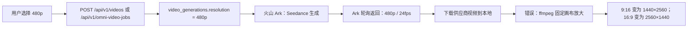
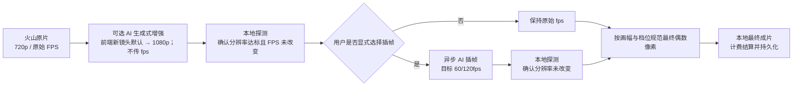

# 视频分辨率、超分与超帧链路整改方案

> 日期：2026-08-13
> 状态：已按修正文档实施，自动化与真实 API 验收记录见本文末尾
> 范围：火山引擎 Seedance 视频生成、下载归档、超分、超帧、视频展示、计费与重启恢复

## 1. 摘要

当前系统能正确将用户选择的 `480p` 传给火山引擎，也能从火山官方 Ark 接口读取到 `480p` 的成功结果；问题发生在供应商结果下载到本地之后。后端为“统一画幅”无条件使用 ffmpeg 将视频重编码到固定的 2K 画布：16:9 为 `2560×1440`，9:16 为 `1440×2560`。

这不是 AI 超分，只是普通插值放大：不会增加细节，反而会放大压缩伪影和模糊。它还使请求规格、供应商回包规格与最终文件像素不一致，造成用户理解、计费审计和质量诊断困难。

最终整改原则：**新生成视频只保留一个最终本地成片：未选择超分时保留原片（若需同档位画幅规范则原地替换）；选择超分时，超分成功并完成最终规格校验后删除原片，只保留超分后的成片；若再选择插帧，只保留最终插帧成片。创作端新镜头默认勾选 AI 超分至 1080p，但允许用户取消或按输入规格选择 720p；智能插帧默认不勾选，只有显式选择目标 fps 才调用和计费。超分与插帧是两个独立、可追踪、可计费的异步阶段。付费阶段结束后，本地只在同一分辨率档位内把 16:9、9:16、1:1、4:3、3:4、3:2、2:3、21:9 规范为精确偶数像素画布，不再把 480p 普通插值放大为 2K。最终规格以本地媒体探测为准。**

## 2. 线上核验事实

核验时间：2026-08-13（UTC）。核验对象：线上用户 `srx1116`（用户 ID `7`）的成功视频任务。

| 项目 | 证据 |
| --- | --- |
| 本地生成记录 | `video_generations.id = 226`，模型 `doubao-seedance-2-0-mini-260615`，请求 `480p`、`9:16`、15 秒 |
| 火山请求 | `POST https://ark.cn-beijing.volces.com/api/v3/contents/generations/tasks`；请求体含 `resolution: "480p"`、`ratio: "9:16"`、`duration: 15`、`task_type: "i2v"` |
| 官方任务标识 | 火山创建响应 HTTP 200，返回 `cgt-20260813154211-6rmg7` |
| 完成确认方式 | 项目后端主动轮询火山 Ark task URL，不是供应商向本项目发起的 HTTP webhook 回调 |
| 官方完成响应 | HTTP 200，`status: "succeeded"`，`resolution: "480p"`，`ratio: "9:16"`，`duration: 15`，`framespersecond: 24`，并返回 TOS 签名视频地址与实际 token usage |
| 后续本地处理 | 成功下载后日志记录“统一画幅尺寸”，目标为 `1440×2560`，随后覆盖本地成片 |

结论：火山官方输出声明为 480p；非预期放大发生在本项目本地归档后，不是火山将 480p 静默生成为 720p/2K。

## 3. 当前链路与根因



根因位于 `backend-node/src/services/videoService.js`：

1. `finalizeSuccessfulVideo()` 下载文件后调用 `maybeNormalizeVideoAfterDownload()`。
2. `maybeNormalizeVideoAfterDownload()` 仅根据 `aspect_ratio` 调用 `targetVideoPixelsForAspect()`，完全忽略用户请求的 `row.resolution`。
3. `targetVideoPixelsForAspect()` 对常见横竖屏返回固定 2K 尺寸。
4. `normalizeVideoFileToTargetPixels()` 使用 `scale + pad` 重新编码并替换下载后的原文件。

因此，代码中的“画幅归一化”混淆了两个概念：

- 画幅（aspect ratio）：16:9、9:16 等构图比例；
- 分辨率（resolution）：480p、720p、1080p 等像素规格。

保持画幅并不要求提高像素数。仅为了统一画幅而拉高长边到 2560 是错误的质量策略。

## 4. 目标链路



### 4.1 规格规则

| 画幅 | 480p 目标尺寸 | 720p 超分目标 | 1080p 超分目标 |
| --- | ---: | ---: | ---: |
| 16:9 | 854×480 | 1280×720 | 1920×1080 |
| 9:16 | 480×854 | 720×1280 | 1080×1920 |
| 1:1 | 480×480 | 720×720 | 1080×1080 |
| 4:3 | 640×480 | 960×720 | 1440×1080 |
| 3:4 | 480×640 | 720×960 | 1080×1440 |
| 3:2 | 720×480 | 1080×720 | 1620×1080 |
| 2:3 | 480×720 | 720×1080 | 1080×1620 |
| 21:9 | 1120×480 | 1680×720 | 2520×1080 |

说明：供应商可能使用同档位的相邻偶数尺寸，例如真实验收曾返回 `1882×1080`。最终规范化允许在同一短边档位内做小幅等比缩放和居中裁切，例如 `1882×1080 → 1920×1080`；不允许再做 `480p → 2K` 的伪超分。输入画幅与目标画幅偏差超过 8% 时拒绝大幅裁切并标记失败。普通 ffmpeg 不承担跨档位超分职责，原片和付费阶段文件均不被覆盖。

### 4.2 处理顺序

1. 火山生成并下载原片，立即保存为 `source_local_path`。
2. 新镜头的持久化默认值为 `resolution=720p`、`upscale_resolution=1080p`、`target_fps=NULL`；用户取消超分后必须明确保存 `NULL`。
3. 仅在 `upscale_resolution` 非空时，使用已持久化原片提交 AI 生成式增强；只允许 720p/1080p，且请求不传 `fps`。
4. 仅在 `target_fps` 非空时创建/恢复插帧任务；输入为超分结果（若选择超分）或原片（未选择超分），只提高 fps，不改变分辨率。
5. 每一步结果下载到本地后都执行媒体探测，并记录真实宽高、fps、时长。
6. 付费阶段结束后，依据 `aspect_ratio + 最终短边档位` 生成独立的规范化文件；原片、超分结果和插帧结果均保留。
7. 最终文件才写入 `local_path` / `video_url` 并标记 `completed`；供应商签名 URL 仅用于一次性下载，不能作为完成态结果。

## 5. 数据模型改造

### 5.1 `video_generations`

在保留当前 `resolution` 作为“火山请求规格”的基础上，新增或明确以下字段：

| 字段 | 含义 |
| --- | --- |
| `requested_resolution` | 用户选择并提交给生成模型的规格；若迁移成本高，可暂由现有 `resolution` 承担 |
| `upscale_resolution` | 可选 AI 超分目标：`720p` 或 `1080p`；`NULL` 表示保持火山原始规格 |
| `source_local_path` | 火山原始结果的本地持久化路径，不被后处理覆盖 |
| `upscale_job_id` / `upscale_status` | 超分任务关联及状态 |
| `interpolation_job_id` / `interpolation_status` | 超帧任务关联及状态（已有字段按实际迁移状态复用） |
| `output_width` / `output_height` | 最终可交付文件的真实像素宽高 |
| `output_resolution` | 根据真实宽高归类的展示档位，或保留形如 `720x1280` 的精确值 |
| `output_fps` | 最终可交付文件 fps |
| `output_duration_ms` | 最终文件真实时长 |

`resolution` 不得在后处理阶段被篡改为“看起来更大”的档位；它用于审计原始请求、价格匹配和供应商响应比对。

### 5.2 `video_upscale_jobs`

新增独立任务表，一条视频生成记录对应最多一个默认超分任务。建议字段：

- `id`, `video_generation_id`, `owner_user_id`
- `billing_authorization_id`
- `provider`, `model`, `target_resolution`
- `source_local_path`, `output_local_path`
- `provider_task_id`, `provider_request_id`
- `status`, `attempts`, `error_msg`
- `output_width`, `output_height`, `output_duration_ms`
- `created_at`, `updated_at`, `completed_at`

需建立唯一约束：`UNIQUE(video_generation_id)`。重启恢复时，已有 `provider_task_id` 的任务只能继续轮询，不能重复提交和重复扣费。

### 5.3 状态机

建议使用明确的业务状态，前端可映射为简洁文案：

```text
processing_generation
  -> downloading_source
  -> upscale_pending             （开启超分）
  -> upscaling
  -> interpolation_pending       （开启超帧）
  -> interpolating
  -> finalizing
  -> completed

任一步失败 -> failed
实际规格超出预授权 -> billing_reconciliation
```

不启用超分、超帧时：`downloading_source -> finalizing -> completed`。

## 6. 后端实施清单

### 6.1 立即修复：停止固定 2K 放大

- 修改 `maybeNormalizeVideoAfterDownload()`：默认不对供应商原片重编码。
- 删除或隔离 `targetVideoPixelsForAspect()` 的固定 2560/1440 映射，避免任何调用路径将其当成输出规格。
- 若视频合成确实需要统一画布，目标必须来自各片段的最终规格策略，且不得把低分辨率片段上采样为伪 2K；优先在合成前拒绝或显式选择统一输出档位。
- 保留原始下载文件到 `source_local_path`，后处理一律创建新文件，禁止覆盖源文件。

### 6.2 超分服务

- 新增 `videoUpscaleService` 与供应商适配器；必须从项目 HTTP API 创建任务，供应商调用只能在后端适配层发生。
- API 创建时完成：鉴权、模型权限、价目校验、预授权、持久化 `processing`。
- 由后台 worker/轮询推进任务；HTTP handler 不进行长轮询。
- 结果地址立即下载到本地，探测输出规格并持久化；失败时释放该阶段授权。

### 6.3 超帧服务调整

- 保留现有 `videoInterpolationService` 的异步、预授权、待对账和重启恢复设计。
- 输入改为“超分输出（若存在）否则原始源片”。
- 删除任何根据输入画幅固定放大的逻辑；超帧仅接受并保留输入尺寸。
- `resolutionTier()` 应读取实际探测尺寸或供应商结果，不能只以 `row.resolution` 推断，避免 480p 文件被错误按 720p 计价。

### 6.4 媒体探测与计费

- 统一封装 `probeVideoMedia(absPath)`：通过本地 ffprobe/ffmpeg 读取 width、height、fps、duration。
- 在“原片下载完成、超分完成、超帧完成、最终合成完成”后调用并保存结果。
- 预授权按请求规格估价；实际结算按供应商真实 usage 和可核验输出规格处理。
- 实际规格或费用超过预授权时进入 `billing_reconciliation`，不得静默少扣、继续交付或回退使用供应商临时 URL。

## 7. API 与前端改造

### 7.1 请求契约

`POST /api/v1/videos` 与 `POST /api/v1/omni-video-jobs` 统一接受：

```json
{
  "resolution": "480p",
  "upscale_resolution": "720p",
  "target_fps": 60
}
```

- `upscale_resolution` 为空或缺省：不超分，保留火山原始规格。
- 当 `resolution = "480p"` 时，仅允许 `upscale_resolution` 为 `null`、`720p` 或 `1080p`。
- 当 `resolution = "720p"` 时，可选 `null` 或 `1080p`；不得执行 720p→720p 的无效超分。
- 当 `resolution = "1080p"` 时，默认不提供超分选项；更高规格需后续以模型能力和价目单独开放。
- 禁止目标小于或等于输入规格的“超分”请求；降采样属于独立导出策略。
- `target_fps` 为空时明确表示不插帧；不得读取管理配置偷偷补成 60fps。前端不得绕过计费直接调用供应商。
- 新镜头前端默认选择 `upscale_resolution="1080p"`，默认 `target_fps=null`；原生请求规格为 1080p 时自动取消重复超分。
- 首镜是本集默认参数源；继承镜头、单镜自定义、恢复默认、复制镜头、自由创作草稿与刷新恢复必须同时同步 `upscale_resolution` 和 `target_fps`。

### 7.2 响应与展示

视频详情/列表返回以下明确字段：

```json
{
  "requested_resolution": "480p",
  "upscale_resolution": "720p",
  "output_width": 720,
  "output_height": 1280,
  "output_resolution": "720p",
  "output_fps": 60,
  "processing_stage": "completed"
}
```

前端展示示例：

`火山生成 480p → AI 超分 720p → AI 超帧 60fps → 成片 720×1280 / 60fps`

分辨率控件建议拆成两个字段，避免“480p”既指生成规格又指最终规格：

| 火山生成规格 | 超分输出选项 | 前端说明 |
| --- | --- | --- |
| 480p | 保持原始、720p、1080p | 选择 720p/1080p 会增加超分处理时间与费用 |
| 720p | 保持原始、1080p | 仅模型和超分服务均支持时展示 1080p |
| 1080p | 保持原始 | 不提供无意义的重复超分 |

提交前必须同时显示原始生成规格、超分目标、超帧目标和对应费用预估。例如：`火山生成 480p → AI 超分 1080p → AI 超帧 60fps`。

需要覆盖：自由创作、普通分镜生成、Omni 视频、视频素材库、任务历史、视频合成详情与刷新后的状态恢复。

## 8. 影响面检查

实施前与实施后均需在 `frontweb/src`、`backend-node/src`、`backend-node/test` 对下列名称执行检索，逐项检查全部消费者：

- `resolution`, `video_resolution`, `output_resolution`, `upscale_resolution`
- `local_path`, `source_local_path`, `video_url`
- `interpolation_status`, `target_fps`, `video_interpolation_jobs`
- `video_generations`, `omni_video_jobs`, `video_merges`
- `completed`, `processing`, `billing_reconciliation`

强制关注路径：

1. 前端 API 封装、自由创作、FilmCreate 分镜和 Omni 请求体。
2. 视频路由、Omni 路由、服务层、模型能力、价目与授权/结算。
3. 供应商任务创建、轮询、完成结果下载、本地/OSS 持久化。
4. 素材导入、视频合成、海报生成和历史视频读取。
5. 服务重启后所有未完成生成、超分、超帧任务的恢复。

本轮实施后检索覆盖结果：

- 前端已覆盖 `videos.js`、`omniVideo.js`、`storyboards.js` 三组 API 封装，以及 `FilmCreate.vue`、`FreeCreate.vue`、`GenerationSettings.vue` 的默认值、请求体、草稿恢复、复制、逐镜覆盖和历史展示。
- 后端已覆盖 `/videos`、Omni 创建/重试、分镜设置路由、`videoService`、`omniVideoService`、`generationSettingsService`、超分/插帧 client 与 worker、启动恢复和计费服务。
- 数据与媒体已覆盖 `storyboards`、`video_generations`、`video_upscale_jobs`、`video_interpolation_jobs`、usage/账本、素材导入、最终素材 metadata、合成读取和 `/static/` 本地播放。
- 测试已覆盖默认 `1080p/null`、显式关闭、首镜主配置/本集继承/逐镜覆盖、画幅矩阵、源片保留、真实 ffmpeg 规范化、阶段幂等和精确计费。
- `AIConfigContent` 中的 30/60/120fps 仅是管理员价目/适配器档位配置，不是创作端默认值；是否插帧只由镜头合同的 `target_fps` 是否非空决定。

## 9. 验收矩阵

| 场景 | 期望结果 |
| --- | --- |
| 火山 480p、9:16、不超分不超帧 | 官方回包与最终文件均为 480 档；不存在 1440×2560 强制放大 |
| 火山 480p、16:9、不超分 | 最终约为 854×480；不存在 2560×1440 强制放大 |
| 480p、9:16、超分至 720p | 原片保留；最终为 720×1280（或供应商可核验等价尺寸） |
| 480p、16:9、超分至 720p | 原片保留；最终为 1280×720（或供应商可核验等价尺寸） |
| 480p、9:16、超分至 1080p | 原片保留；最终为 1080×1920（或供应商可核验等价尺寸） |
| 480p、16:9、超分至 1080p | 原片保留；最终为 1920×1080（或供应商可核验等价尺寸） |
| 超分 + 60fps 超帧 | 输出分辨率保持超分结果，fps 为 60；不会二次放大 |
| 超分关闭 + 60fps 超帧 | 输出像素保持原片，只有 fps 改变 |
| 供应商任务失败 | 对应阶段任务失败、授权释放；不标记 completed |
| 实际规格超预授权 | 进入待对账，不静默少扣费 |
| 刷新与服务重启 | 可读取最终本地文件；有 `provider_task_id` 的任务继续轮询、不重复提交 |
| Omni / 分镜 / 自由创作 | 三条入口遵守相同的规格、持久化与计费语义 |

执行命令：

```bash
cd backend-node && node --test test/*.test.js
cd frontweb && node --test test/*.test.js
cd frontweb && npm run build
```

真实供应商验收必须经登录后的项目 HTTP API 发起，使用业务请求 ID 与完整计费闭环；禁止在脚本、REPL 或测试工具中直连供应商。

## 10. 发布策略

1. 第一阶段：发布“停止固定 2K 放大”和真实媒体探测，先止损；不批量重写历史成片。
2. 第二阶段：部署数据库迁移、超分任务表、模型配置和价目；新镜头默认勾选 1080p 超分，允许用户逐镜或按本集默认取消。
3. 第三阶段：前端按模型能力开放“保持原片 / 超分至 720p / 1080p”和“不开启 / 60 / 120fps”设置，明确展示链路与后处理费用。
4. 观察生成成功率、输出规格分布、待对账数、重启恢复数和用户播放错误率。
5. 回滚时仅关闭新超分入口；已提交的异步任务仍必须持续轮询并持久化到终态，不能将源片伪装为最终成片。

## 11. 完成定义

- 火山 480p 原片不会再被普通 ffmpeg 强制放大为 2K。
- 超分、超帧为两个独立、可配置、可审计、可计费的异步阶段。
- 最终文件的宽高、fps、时长可由本地媒体探测证明，并向前端返回。
- 请求规格、供应商响应、账本、任务记录和最终本地文件之间可追溯且不互相矛盾。
- 所有视频入口、刷新、服务重启恢复和本地持久化均通过自动化测试与生产构建验证。

## 12. 2026-08-14 实施与验收记录

### 12.1 已实施

- 删除下载后固定 ffmpeg 放大到 2K 的行为；未超分时原片是唯一成片，超分成功后只保留超分成片。
- 新增迁移 `55_video_intermediate_cleanup_opt_in.sql`：已有线上记录默认 `intermediate_cleanup_enabled=0`，绝不扫描、删除或改写；仅新创建的视频写入 `1` 并在最终验收通过后清理中间文件。
- 新增 `video_upscale_jobs`、超分状态/本地路径/预授权字段，以及官方生成式增强 HTTP 适配器。
- 工作流改为按选择分支：`Seedance → 本地原片 → [可选超分] → [可选插帧] → 精确画幅规范 → completed`；新镜头默认 1080p 超分，默认不插帧。
- 超分请求使用 `/api/v1/tools/enhance-video-generative`，省略 `fps`；插帧请求使用 `/api/v1/tools/video-frame-interpolation` 和 `client_token`。
- 生成、超分、插帧分别预授权、结算和记录 usage；失败释放未消费冻结，超额进入待对账。
- 重启恢复超分或插帧供应商任务后会重新接回最终画幅规范与持久化链路，不会重复提交生成任务。
- 分镜新增 `video_upscale_resolution`、`video_target_fps`；首镜、本集默认、继承、自定义、恢复、复制和刷新读取使用同一合同。
- 创作端新增独立超分/插帧选择、链路预览和后处理费用报价；超分只开放 720p/1080p，插帧默认关闭。
- 最终画幅根据短边档位生成精确偶数像素，偏差超过 8% 时拒绝大幅裁切。

### 12.2 真实项目 API 验收

所有真实调用均从本项目登录态 HTTP API 发起，没有在脚本中直接调用供应商或内部 service。

| 项目 | 验收结果 |
|---|---|
| 业务入口 | `POST /api/v1/videos`，业务请求 ID `real-closure-20260814-002` |
| 生成记录 | `video_generations.id = 60`，Seedance 2.0 Mini，480p，4 秒 |
| Seedance 任务 | `cgt-20260814094945-d276v`；实际 usage `40594 output_token` |
| 原片持久化 | `library/videos/vg_60_6ced0ec6.mp4`，本地存在 |
| 超分任务 | `amk-tool-enhance-video-generative-943473449218`；输出本地存在，`1882×1080 / 24fps / 4.10s` |
| 插帧任务 | `amk-tool-video-frame-interpolation-770688833282`；最终本地存在，`1882×1080 / 60fps / 4.11s` |
| 最终 URL | `/static/library/videos/vg_60_interpolated_60fps.mp4`；该记录是画幅精确规范化加入前的阶段验收，不能替代本轮最终验收 |
| 实际结算 | 生成 `93.3662`、超分 `68.3333`、插帧 `16.44` 积分；最终冻结为 0 |
| 对账 | 无待对账记录 |
| 重启恢复 | 后端重启后通过 `GET /api/v1/videos/60` 仍读取三段 completed 与本地最终规格 |

本轮最终默认策略的真实验收记录：

| 项目 | 验收结果 |
|---|---|
| 业务入口 | 登录后 `POST /api/v1/videos`；业务幂等 ID `acceptance-default-upscale-1080-no-fps-20260814-01` |
| 生成记录 | `video_generations.id = 61`，Seedance 2.0 Mini，720p、9:16、4 秒 |
| 请求策略 | `upscale_resolution=1080p`，`target_fps=null`；接口链路为 `火山生成 720p → AI 超分 1080p → 本地规范 9:16` |
| Seedance 任务 | `cgt-20260814104058-kglp4`；实际 usage `87300 output_token` |
| 原片持久化 | `projects/0008_20260812_1/videos/vg_61_3961a59f.mp4`，`720×1280 / 24fps / 4.10s` |
| 超分任务 | MediaKit request ID `20260814104303263AD12AC7B805A887D6`；本地输出 `vg_61_upscaled_1080p.mp4`，`1080×1920 / 24fps / 4.10s` |
| 插帧 | `interpolation_status=skipped`，任务数 0、授权数 0、usage 数 0，输出仍为 24fps |
| 实际结算 | 生成 `200.79` 积分；超分按真实 4100ms 结算 `68.3333` 积分；冻结积分归零，无待对账 |
| 本地播放 | `/static/projects/0008_20260812_1/videos/vg_61_upscaled_1080p.mp4` 的 Range 请求返回 `206` |
| 重启恢复 | 服务重启后仍为 `completed/completed/skipped`、`1080×1920/24fps`；超分任务仍 1、插帧任务仍 0、账本和 usage 数量不变 |
| 分镜同步 | `GET /api/v1/episodes/5/generation-settings` 返回本集默认 `720p + 1080p 超分 + target_fps=null`，首镜 effective 配置一致 |

后续存储策略修正：验收记录 `id=61` 创建于单成片清理策略之前，迁移 55 为其保留 `intermediate_cleanup_enabled=0`，原片和超分片均不删除。部署后新建的视频才写入 `1`：超分成功后原片会清理；未超分则只保留原片；有插帧则只保留最终插帧成片。

说明：真实请求的中文提示词在 Windows PowerShell 管道验收脚本中发生编码损坏，因此本记录只认定视频规格、持久化、计费与恢复链路通过，不把该脚本视为中文提示词编码验收。产品前端和后续含中文的本地 HTTP 验收仍应使用浏览器或带 Unicode 转义的 Node 请求体。

另保留一次真实失败记录 `video_generations.id = 59`：供应商拒绝 Mini T2V 的 `camera_fixed` 参数。系统释放了生成、超分、插帧三段预授权；适配器已修正为该模型的 T2V 请求省略此字段。

### 12.3 自动化结果

- 后端：`151/151` 通过（含默认选择、同步继承、画幅矩阵、源文件保留和真实 ffmpeg 规范化测试）。
- 前端：`27/27` 通过。
- 前端 production build：通过；仅保留 Vite 既有大 chunk 提示。
- 图片价格重启回归：`POST /api/v1/billing/quotes` 在重启后返回 `22` 积分/张。
