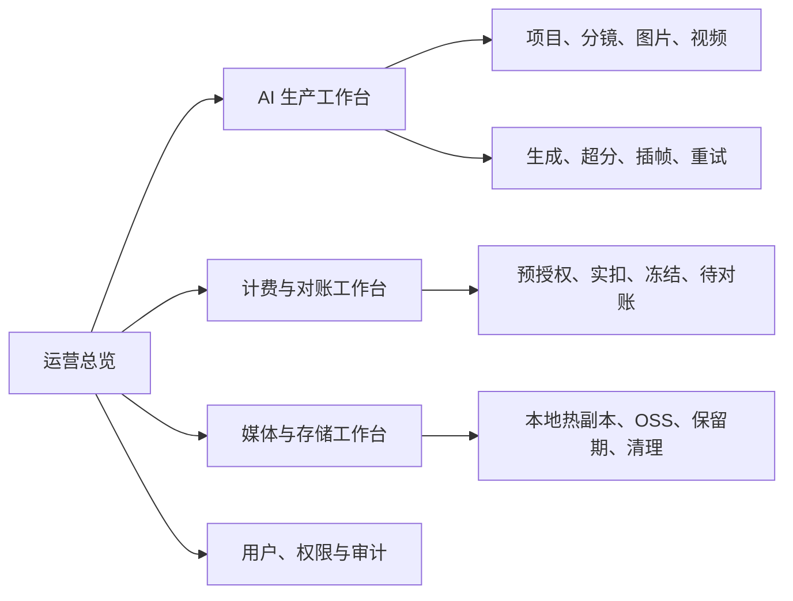

# AI 漫剧后台运营控制台改进方案

> 日期：2026-08-14
> 状态：方案，尚未实施
> 范围：管理员后台的可观测性、运营处置和数据下钻；不改变现有用户创作工作流、供应商调用、计费规则或线上历史数据。

## 1. 结论与目标

现有后台管理不是最优解。它已具备账户、价目表、账本流水、模型用量和审计记录，是可用的**账务维护页**；但不能让运营人员快速回答以下问题：

1. 当前 AI 漫剧生产是否健康，卡在哪个阶段？
2. 哪些任务失败、超时、待对账，应该由谁处理？
3. 视频超分、插帧后的最终素材是否已安全归档到 OSS？
4. 今日积分消耗、冻结和异常风险分别来自哪些模型、项目和用户？

目标不是增加一个只展示大数字的大屏，而是建设一个可下钻、可处置、可审计的**运营控制台**。所有汇总必须可追溯至现有 SQLite 事实数据；所有管理动作必须保持现有鉴权、幂等和审计边界。

## 2. 现状审计

### 2.1 已有能力

| 能力 | 现有数据/接口 | 当前前端状态 |
| --- | --- | --- |
| 用户与积分 | `billing_accounts`、`billing_transactions`、`/admin/users` | 已有 |
| 价目表 | `billing_price_books`、`billing_price_book_items`、`/admin/price-books` | 已有 |
| 模型用量 | `billing_usage_logs`、`/admin/usage` | 已有分页表格 |
| 管理员审计 | `billing_audit_logs`、`/admin/audit-logs` | 已有分页表格 |
| 计费待对账 | `billing_reconciliation_cases`、`/admin/billing-reconciliations`、结算/豁免接口 | **后端已有，前端缺入口** |
| 视频后处理 | `video_upscale_jobs`、`video_interpolation_jobs`、`video_generations` | 仅在创作链路中局部可见 |
| OSS 与热副本 | `media_archive_records`、视频归档字段 | 无后台运营视图 |

当前实现集中在 `frontweb/src/views/AdminConsole.vue` 的五个 Tab，数据加载以单页表格为主。后端管理员路由由 `backend-node/src/routes/admin.js` 提供，并由管理员中间件保护。

### 2.2 主要问题

1. **没有运营总览。** 管理员需逐页查表，无法第一时间了解生产、资金和存储风险。
2. **后端能力未闭环到界面。** 待对账案件已存在，但管理员无法在后台看见或处置。
3. **没有任务状态链路。** 视频生成、超分、插帧、归档分散在多表，无法按一次创作任务串联。
4. **媒体持久化不可观测。** 无法查看 OSS 同步成功率、待重试数、热副本待清理量及失败原因。
5. **没有统一筛选和下钻。** 时间、项目、用户、模型、状态之间无法交叉定位。
6. **不适合扩大规模。** 若直接在浏览器下载所有日志再统计，SQLite 数据增长后会造成页面缓慢且统计口径不稳定。

## 3. 目标信息架构

建议将 `/admin` 从单一大组件拆为“运营总览 + 四个工作台”。首期仍可保留 `/admin` 入口，但用子路由或 `route.query` 固化当前页面、时间范围与筛选条件，支持刷新、复制链接和重新登录后的恢复。

### 3.1 运营总览（默认页）

按 `24h / 7d / 30d / 自定义时间` 展示，并以北京时间作为筛选和展示时区：

| 区域 | 必须指标 | 下钻目标 |
| --- | --- | --- |
| AI 生产 | 任务总数、成功率、失败数、处理中数、最长等待时间 | 生产工作台，预填状态与时间 |
| 视频后处理 | 超分/插帧完成、失败、跳过、处理中 | 对应视频任务及阶段日志 |
| 计费 | 已实扣积分、当前冻结、待对账冻结、退款/调整 | 账本或待对账工作台 |
| 媒体持久化 | OSS 已同步、待同步、同步失败、本地待清理 | 媒体与存储工作台 |
| 风险队列 | 待对账、长时间任务、连续失败、OSS 重试失败 | 可执行的异常列表 |

总览卡片必须展示“统计截至时间”和数据范围。数字可点击；禁止只显示无明细来源的聚合结果。

### 3.2 AI 生产工作台

以一次媒体生产为主线，关联项目、分镜、用户、模型、计费授权和媒体结果。支持项目、用户、模型、媒体类型、状态、阶段、时间范围筛选。

标准阶段：

`已创建 → 供应商生成 → 本地持久化 → 超分（可选）→ 插帧（可选）→ OSS 归档 → 完成`

状态必须区分：`processing`、`upscaling`、`interpolating`、`billing_reconciliation`、`completed`、`failed`、`cancelled`。详情侧栏至少显示：内部任务 ID、供应商请求 ID、请求/完成时间、耗时、错误摘要、计费状态、最终本地路径和 OSS URL。

仅对已有且安全的动作提供按钮，例如“重新拉取状态”“重试 OSS 同步”。涉及退款、豁免、重提供应商任务等高影响动作必须二次确认，并提交幂等键和审计记录。

### 3.3 计费与对账工作台

保留用户余额、价目表、流水与用量四块既有能力，并补齐待对账工作台。

待对账页字段：案件 ID、用户、服务/模型、冻结积分、供应商请求 ID、原因、发现时间、到期时间、状态、处置人、结算/豁免结果。管理动作仅允许调用现有的结算和豁免 API，不能修改账本历史记录或在前端自行计算积分。

价目表须展示：计量单位、计费单元、积分单价、换算说明、价目版本、生效区间、来源链接和最后核验日期。固定说明：**100 积分 = 1 元；`micro` 为内部精度单位，不能直接展示为积分。**

### 3.4 媒体与存储工作台

以 `media_archive_records` 为归档事实来源，关联视频/图片实际产物。分组展示：

- `local_ready`：本地文件就绪，尚未进入 OSS 链路；
- `pending`：等待或重试 OSS 同步；
- `oss_synced`：OSS 已同步且有校验结果；
- `local_pruned`：OSS 校验成功后，本地热副本按保留策略清理；
- 失败：显示最近错误、尝试次数、最后更新时间。

详情需要提供对象 Key、OSS URL、ETag、文件大小、最后校验时间、本地删除计划。链接必须来自受控 OSS 公共基址和标准对象 Key，不能展示供应商临时签名 URL。

### 3.5 用户、权限与审计

首期延续现有 `admin` / `user` 两级角色。用户页展示余额、冻结、累计充值/消费、最近登录和账号状态；审计页支持按操作者、动作、目标类型和时间过滤。后续如有运营人员只读需求，再增加显式 `operator_readonly` 角色，不把管理员 Cookie 转交给运营人员。

## 4. 后端接口与数据口径

### 4.1 新增只读聚合 API

所有聚合在后端 SQLite 查询中完成，返回 UTC ISO 时间和明确的统计窗口；前端仅格式化为 `Asia/Shanghai`。建议接口：

| API | 用途 |
| --- | --- |
| `GET /api/v1/admin/overview?from=&to=&tz=Asia/Shanghai` | 顶部 KPI、趋势、风险摘要 |
| `GET /api/v1/admin/production` | 媒体生产链路的分页明细与筛选 |
| `GET /api/v1/admin/production/:id` | 单条任务阶段、计费、存储详情 |
| `GET /api/v1/admin/media-archives` | OSS/热副本归档分页明细与汇总 |
| `GET /api/v1/admin/billing-reconciliations` | 现有接口接入前端，不重复建表 |

接口均须复用 `requireAdmin`。列表接口统一 `page`、`page_size`（最大 100）、`from`、`to`、`status`、`user_id`、`project_id`、`model` 等规范参数，返回 `{ items, page, page_size, total, generated_at }`。

### 4.2 聚合口径

| 指标 | 事实来源 | 规则 |
| --- | --- | --- |
| 实扣积分 | `billing_usage_logs.charged_micro` | 以 usage 日志创建时间归属窗口，不以预授权计算 |
| 冻结积分 | `billing_accounts.frozen_micro` | 当前时点快照，不与窗口实扣相加 |
| 待对账冻结 | 待处理案件关联的 authorization | 仅 `pending` 状态，避免重复累计 |
| 生产成功率 | 图片/视频终态记录 | `completed / (completed + failed)`；处理中不进分母 |
| 后处理成功率 | `video_upscale_jobs` / `video_interpolation_jobs` | 按各自终态单独计算，不把未选择视为失败 |
| OSS 同步情况 | `media_archive_records.archive_status` | 以归档账本为准，视频表字段只作兼容展示 |
| 长时间任务 | 各任务 `updated_at` 与阶段阈值 | 阈值需配置，不硬编码在前端 |

数据量增长后，先增加复合索引并限制查询窗口；只有统计查询达到明确性能阈值时，再增加按天滚动汇总表。首期不提前引入缓存或第二套数据仓库，避免口径漂移。

## 5. 前端实现准则

1. 将巨型 `AdminConsole.vue` 拆成路由级页面和可复用表格/筛选器；保留现有账务组件与 API 合约。
2. 默认用 Element Plus 的统计卡、进度、Tag、表格，加少量 SVG 趋势条；首期不引入大型图表依赖。只有多序列/缩放/交叉筛选确有需求时，按路由懒加载 ECharts。
3. 状态使用统一字典，颜色不能作为唯一信息载体；失败必须显示短文本原因，详情可看完整错误。
4. 常驻总览 60 秒轮询，生产/媒体页面 30 秒轮询；用户切换页面或手动暂停时停止。不得在 HTTP handler 中轮询供应商。
5. 加载、空数据、权限拒绝、网络失败、筛选无结果均应有清晰状态；不可用 `0` 掩盖请求失败。
6. 所有用户可见时间调用现有 `formatChinaDateTime`，存储与接口仍为 UTC ISO。

## 6. 分期实施

### P0：契约与数据正确性（先行）

- 为现有管理员接口补齐过滤、分页元数据和测试。
- 统一任务阶段状态字典及阶段阈值配置。
- 校验总览聚合与原始账本、任务、归档记录能逐项对上。
- 将现有待对账接口加入前端 API 封装，但不改变结算逻辑。

### P1：最小运营闭环

- 新建运营总览。
- 上线待对账工作台和处置确认流程。
- 上线媒体与存储工作台，包含 OSS 状态、失败、重试和本地清理计划。
- 完成总览到明细的下钻链接。

### P2：生产效率闭环

- 上线 AI 生产工作台、任务详情时间线、项目/分镜关联。
- 按视频生成、超分、插帧分别展示状态和耗时。
- 将安全的任务重试与重新归档动作纳入后台。

### P3：规模化运营

- 增加只读运营角色、导出、定期报表和可配置告警阈值。
- 仅在实际查询压力达到阈值后，引入日汇总表和必要图表组件。

## 7. 兼容与安全边界

- 不迁移或重写已有 SQLite 历史数据；新接口对缺失的旧字段返回兼容值和数据可用性说明。
- 不修改现有生成、超分、插帧、OSS 上传、热副本清理或计费结算流程；后台仅消费其持久化结果。
- 不暴露 AK、供应商密钥、Cookie、完整请求体或含敏感字段的日志。
- 供应商调用仍仅从项目 HTTP 业务路由进入；控制台不得直接调用供应商 API。
- 高影响操作必须有二次确认、原因、幂等键和 `billing_audit_logs` 审计。
- 所有完成媒体仍以本地可恢复路径和 OSS 归档为准，不将供应商临时 URL 作为结果兜底。

## 8. 验收标准

1. 管理员可在一个页面内看见生产、计费、媒体存储与风险摘要，并可下钻到对应明细。
2. `overview` 的实扣、冻结、待对账、OSS 状态分别与原始表查询一致；抽样 10 条明细可完全追溯。
3. 待对账案件能看见、补录结算或豁免；每次操作产生审计记录，重复提交不重复扣费。
4. 任意视频可追溯生成、超分（可选）、插帧（可选）、最终本地/OSS 产物和计费流水。
5. OSS 同步失败、待同步、本地清理计划均可见，且仅对已校验 OSS 对象显示“允许清理本地”。
6. 时间筛选按北京时间语义执行，接口与数据库仍传输/保存 UTC ISO。
7. 非管理员访问全部新接口和页面均被拒绝；不泄露供应商凭据和临时签名 URL。
8. 完成后运行后端测试、前端测试与 production build；至少验证一次刷新页面和重启服务后的读取一致性。

## 9. 实施前影响面检查清单

- 前端：`frontweb/src/router`、`frontweb/src/api/account.js`、`frontweb/src/views/AdminConsole.vue`、账本组件、时间格式化工具。
- 后端：`backend-node/src/routes/admin.js`、`backend-node/src/routes/index.js`、计费/视频/超分/插帧/媒体存储服务及数据库迁移。
- 测试：管理员鉴权、分页过滤、聚合口径、待对账处置幂等、OSS 归档状态、刷新/重启恢复。
- 发布：不需要数据重写；新索引和新只读接口可增量部署，保留旧后台入口直至 P1 验收完成。
