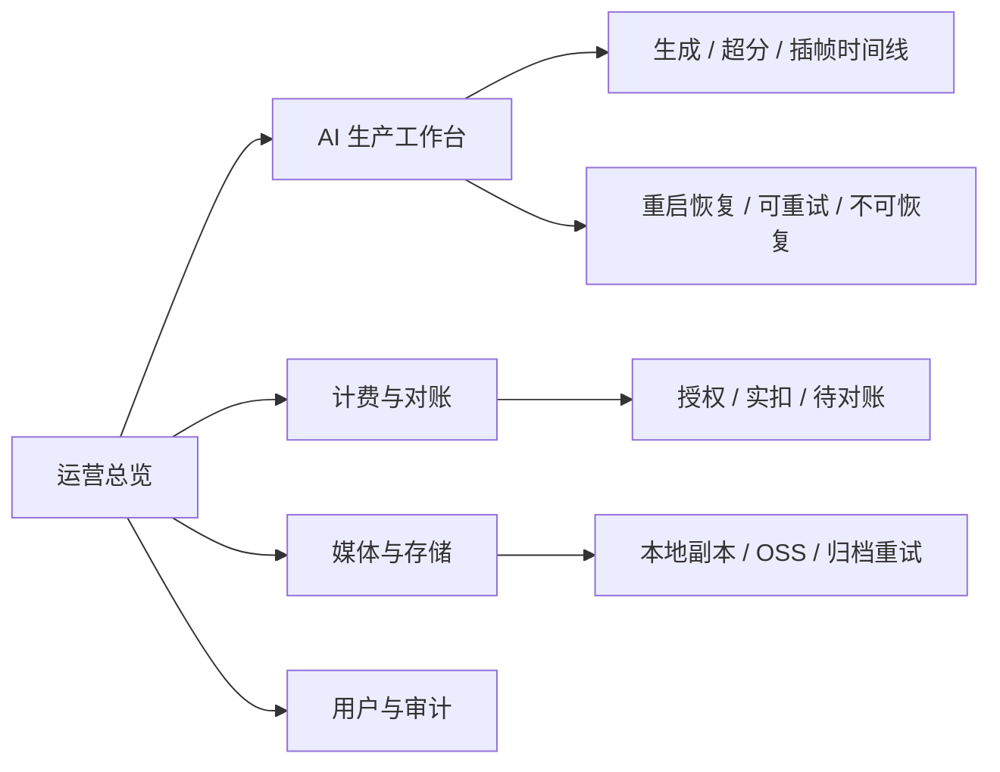

# 后端全链路闭环审查与运营控制台改造计划

> 计划日期：2026-08-17（周一）
> 状态：待实施
> 合并来源：`2026-08-14-ai-comic-admin-operations-console-improvement.md`、`2026-08-14-current-project-end-to-end-closure.md`，以及 2026-08-14 线上任务/发布复盘。
> 范围：审查并固化当前后端异步任务、计费、媒体、恢复与发布链路；将已有的重试能力完整暴露到用户和管理员可处置界面。不是重做超分重试，也不改写历史任务。

## 1. 审查结论：已有机制与真正缺口

本轮结论不是“项目没有重试”。现有后端已经实现了关键重试与恢复能力：

| 已有能力 | 现有实现入口 | 审查结论 |
| --- | --- | --- |
| 原视频处理任务恢复 | `videoService.resumeProcessingVideoGenerations()` | 服务启动后恢复带供应商任务 ID 的轮询；无任务 ID 的中断任务会进入 `retryable`，而非永久 `processing`。 |
| 超分阶段重试 | `videoUpscaleService.retryFromSource()` | 仅用已持久化原片重试超分；失败授权先释放，再建立本阶段的新授权，避免双冻结。 |
| 插帧阶段重试 | `videoInterpolationService.retryFromSource()` | 仅用已有超分片/原片重试插帧，并沿用同样的授权清理边界。 |
| 后处理重启恢复 | `videoUpscaleService.resumePending()`、`videoInterpolationService.resumePending()` | 启动后恢复 `awaiting_source`、`pending`、`processing` 阶段。 |
| Omni 用户端处置 | `POST /omni-video-jobs/:id/retry`、`retry-postprocess`、`adopt-source` | 支持中断任务重试、只重试超分/插帧、采用已生成原片。 |
| OSS 归档重试 | `resumePendingVideoArchives()`、`startPendingVideoArchiveRetry()` | 保留本地可播放文件，按周期重试归档，不将归档失败伪装为视频失败。 |
| SD2 恢复 | `resumePendingCertifications()`、`startSd2WaitingGenerationRecovery()` | 服务重启后继续恢复认证/等待认证任务。 |
| 计费恢复与对账 | `recoverCompletedVideoReconciliations()` 等 | 结算异常进入可恢复/待对账路径，而不是静默扣费。 |

真正需要在周一处理的是：**以一次完整的后端链路审查验证这些能力是否覆盖每个入口、每个状态转换和每个消费界面；将已存在的“可重试/待处置/已保留原片”从日志和局部 API 变成可观测、可下钻、可安全处置的产品闭环。**

不允许再出现以下结果：

1. 数据库任务有状态，但用户只能看到“未知”或无限加载；
2. 后端已可重试，但前端/管理员端没有入口、没有原因、没有下一步；
3. 服务重启后任务虽被恢复，但恢复失败未进入显式 `retryable`、`failed` 或 `reconciliation_required`；
4. 重试覆盖了上游已经成功的阶段，造成重新提交、重复收费或覆盖本地文件；
5. 发布已推送但 GitHub 部署失败/未完成，任务仍被当作已上线。

## 2. 审查对象与闭环合同

### 2.1 全链路对象

审查必须覆盖所有通过项目 HTTP API 发起的异步能力，而不仅是火山超分：

每个阶段都必须能回答下列问题，并由自动化测试或只读线上记录验证：

| 审查维度 | 必须证据 |
| --- | --- |
| 提交 | 内部任务 ID、供应商任务/请求 ID、请求快照、幂等键、授权 ID 是否已持久化？ |
| 处理中 | 哪个后台执行器负责继续处理？任务是否有明确的最终超时/失败语义？ |
| 重启 | 启动恢复函数是否会发现该状态？会查询原任务还是错误地重新提交？ |
| 失败 | 错误是否被分类为可重试、不可恢复或待对账？用户可见摘要是否确定？ |
| 重试 | 重试是否只针对失败阶段？是否保留上游产物、释放旧授权并防止重复收费？ |
| 持久化 | 完成态是否已校验本地路径和媒体规格，而非保存供应商临时 URL？ |
| 消费 | 分镜、自由创作、Omni 历史、素材库、成片入口和管理员端是否读取同一终态？ |
| 运营 | 是否能按任务、用户、项目、模型、阶段、错误码与时间定位，并留下审计？ |

### 2.2 状态收敛规则

现有状态不要求为统一重构而改名；审查的目标是保证现有状态在任何异常后有唯一、可解释的去向。

| 场景 | 合法收敛结果 | 禁止结果 |
| --- | --- | --- |
| 原视频处理中，已有供应商任务 ID，服务重启 | 恢复查询原供应商任务，再持久化或明确失败 | 创建第二个供应商任务、永久停在 `processing` |
| 原视频处理中，无供应商任务 ID | `retryable` 或不可恢复 `invalid`，附带原因 | 空任务仍显示处理中 |
| 超分/插帧失败，上游片已落盘 | 保留原片/上游片，允许仅阶段重试或采用原片 | 重新生成原视频、删除唯一可用文件 |
| 后处理完成但 usage 不确定 | `reconciliation_required` / `billing_reconciliation` | 静默扣费或静默释放 |
| OSS 同步失败 | 本地完成视频仍可读，归档为待重试/失败 | 把视频主任务改成失败、提前删除本地文件 |
| 供应商状态无法确认 | 明确显示“正在恢复”或“待人工处置”，并记录最近检查时间 | 前端无限加载、错误文案为空 |
| 发布 | GitHub workflow 成功、服务器 SHA 一致、容器 healthy、公网健康检查通过 | 仅凭 `git push` 宣布上线 |

## 3. 周一审查任务（先审计，后补缺）

### A. 后端入口与消费者检索

使用 `rg` 建立“任务类型 × 状态 × 生产者 × 恢复器 × 重试入口 × 前端消费者”矩阵，最少覆盖：

- `backend-node/src/routes/index.js`、`videos.js`、`omniVideo.js`、`admin.js`；
- `videoService.js`、`videoUpscaleService.js`、`videoInterpolationService.js`、`omniVideoService.js`、`mediaStorageService.js`、`assetSd2Service.js`、`billingService.js`、`taskService.js`；
- `frontweb/src/api`、`FreeCreate.vue`、分镜工作台、素材库、视频合成、`AdminConsole.vue`；
- `backend-node/test` 中的重启恢复、阶段重试、授权释放、对账、归档和路由鉴权测试。

输出物：一张覆盖矩阵。任何任务状态若找不到恢复器、用户端展示或运营端可见性，标为 P0 缺口；不要根据名称猜测已覆盖。

### B. 状态转换与账务审查

逐阶段审查创建、更新、完成、失败、重试、取消、重启恢复、对账的 SQL 写入及调用顺序：

1. 每个供应商调用均由 `/api/v1/...` 业务路由触发，且先完成鉴权、模型权限、价目校验、预授权；
2. 每个后续轮询都使用已保存的供应商任务 ID；
3. 每个重试都验证上游本地文件、仅作用于失败阶段，并确认旧授权结算/释放语义；
4. 每个完成态均验证本地路径可读，且重启后可从数据库恢复；
5. 每个异常账务状态进入对账案件，管理员处置幂等且有审计；
6. 每个状态变动要有可给用户和管理员展示的脱敏错误摘要、更新时间和下一步动作。

### C. 恢复演练（不触发非必要真实 AI 调用）

针对现有持久化任务记录和测试桩，完成以下闭环：

1. 原视频 `processing` 且有供应商任务 ID：重启后确认只恢复轮询；
2. 原视频 `processing` 且无供应商任务 ID：确认变为 `retryable` 或 `invalid`，而不是悬挂；
3. 超分失败：确认原片保留、刷新后可播放、只重试超分时不会重新生成原视频；
4. 插帧失败：确认上游超分片/原片保留、只重试插帧；
5. 已完成本地视频但 OSS 失败：确认视频仍可访问，归档调度器可恢复；
6. `reconciliation_required`：确认既不重复扣费，也不在恢复中擅自结算；
7. 前端刷新及后端重启后，任务详情、历史记录与素材库读取同一终态。

如发现缺口，先补最小保护逻辑和测试；不对历史任务批量重试、重算或改写状态。真实供应商验证仅在有对应项目 HTTP API、用户授权且计费链路完整时进行。

## 4. 运营控制台：把已有恢复能力变为可运营闭环

保留给定方案中的“运营总览 + 四个工作台”信息架构，并将本次审查维度纳入生产工作台。

### 4.1 运营总览（默认页）

按 `24h / 7d / 30d / 自定义` 时间窗口统计，界面使用 `Asia/Shanghai`，接口仍传 UTC ISO。每个数字必须可下钻并显示统计截至时间。

| 区域 | 指标 | 下钻 |
| --- | --- | --- |
| AI 生产 | 总数、成功、失败、处理中、`retryable`、最长等待 | 生产工作台，预填状态/阶段 |
| 后处理 | 超分/插帧完成、失败、可阶段重试、采用原片数 | 对应视频和阶段时间线 |
| 恢复风险 | 重启恢复中、无供应商任务 ID、长时间无更新、连续失败 | 风险队列与任务详情 |
| 计费 | 实扣、冻结、待对账冻结、结算/豁免 | 账本与对账工作台 |
| 存储 | 本地就绪、OSS 待同步、归档失败、待清理 | 媒体与存储工作台 |
| 发布健康 | 最近部署 SHA、workflow 结论、容器状态、健康检查时间 | 发布记录/外链 |

### 4.2 AI 生产工作台

以一次媒体生产关联项目、分镜、用户、模型、计费授权、原片、超分、插帧和最终媒体。支持按用户、项目、模型、媒体类型、阶段、状态、错误码和时间筛选。

详情时间线至少显示：内部 ID、供应商请求 ID、当前与历史状态、触发来源（提交/轮询/重启恢复/用户重试）、开始/更新时间、耗时、重试次数、错误摘要、授权/对账状态、本地路径是否可读、OSS 状态。

处置按钮必须映射到已有安全业务语义，而不是直接调供应商：

- “重新拉取状态”：仅查询已保存的供应商任务；
- “仅重试超分 / 插帧”：调用已有阶段重试链路；
- “采用原片”：只切换已存在的本地可用产物，不产生供应商调用；
- “仅重试 OSS”：只重试归档；
- “结算/豁免”：复用既有待对账 API。

高影响操作必须二次确认、填写原因、携带幂等键并写入审计；不提供默认批量“重提供应商任务”。

### 4.3 计费、存储、审计工作台

沿用给定方案：

- 计费与对账以 `billing_accounts`、`billing_transactions`、`billing_usage_logs`、`billing_reconciliation_cases` 为事实来源；前端不自行算积分，`100 积分 = 1 元`，`micro` 不直接展示。
- 媒体与存储以 `media_archive_records` 为归档事实来源，展示 `local_ready`、`pending`、`oss_synced`、`local_pruned`、失败原因、尝试次数、ETag 和本地清理资格。
- 用户、权限与审计保留 `admin`/`user` 边界；后续只读运营人员使用明确 `operator_readonly`，不共享管理员 Cookie。

### 4.4 原未执行方案的完整实施清单（本次原样纳入）

以下项目来自 `2026-08-14-ai-comic-admin-operations-console-improvement.md`，本计划将其作为明确交付范围，而非仅作参考。

#### 现状与拆分目标

- 现有 `frontweb/src/views/AdminConsole.vue` 的五个 Tab 是账务维护页，不足以承担生产运营；保留既有 `/admin` 入口，但拆为路由级的“运营总览、AI 生产、计费与对账、媒体与存储、用户与审计”。
- 当前已有用户/积分、价目表、用量、审计、待对账后端接口、视频后处理记录和归档记录；待对账、后处理、归档缺少完整的管理端可视化与下钻。
- 路由或 `route.query` 必须固化子页面、时间窗口和筛选条件，支持刷新、复制链接和重新登录后的恢复。

#### 生产与后处理详情字段

生产明细和侧栏必须关联项目、分镜、用户、模型、媒体类型、阶段、状态、计费授权和媒体结果，并至少展示：

- 内部任务 ID、供应商请求 ID、请求/完成时间、耗时、错误摘要和完整脱敏错误；
- 视频生成、超分、插帧、归档各阶段状态及重试/恢复来源；
- 计费状态、授权/用量/待对账关联；
- 最终本地相对路径、OSS URL、对象 Key、ETag、文件大小、最后校验时间与本地清理计划；
- 标准阶段：`已创建 → 供应商生成 → 本地持久化 → 超分（可选）→ 插帧（可选）→ OSS 归档 → 完成`。

状态字典由后端统一提供，颜色不能是唯一信息载体；失败必须展示短文本原因，详情可查看脱敏错误。不得把未选择的超分/插帧计为失败。

#### 计费与对账详细范围

待对账列表字段固定为：案件 ID、用户、服务/模型、冻结积分、供应商请求 ID、原因、发现时间、到期时间、状态、处置人、结算/豁免结果。管理端只能调用已有结算和豁免业务 API，不能改写账本历史或在浏览器计算积分。

价目表必须显示计量单位、计费单元、积分单价、换算说明、价目版本、生效区间、来源链接和最后核验日期；固定说明为 **100 积分 = 1 元，`micro` 仅为内部精度单位**。

#### 媒体与存储详细范围

媒体工作台以 `media_archive_records` 为归档事实来源，视频表字段仅作兼容展示。需要按 `local_ready`、`pending`、`oss_synced`、`local_pruned`、失败分组；失败项显示最近错误、尝试次数和最后更新时间。

仅当 OSS 对象校验成功时显示“允许清理本地”；OSS URL 必须由受控公共基址和标准对象 Key 组成，绝不展示供应商临时签名 URL。

#### 指标口径（后端聚合）

| 指标 | 事实来源 | 规则 |
| --- | --- | --- |
| 实扣积分 | `billing_usage_logs.charged_micro` | 按 usage 日志创建时间归属窗口，不以预授权计算 |
| 当前冻结 | `billing_accounts.frozen_micro` | 当前时点快照，不与窗口实扣相加 |
| 待对账冻结 | 待处理案件关联 authorization | 仅统计 `pending`，避免重复累计 |
| 生产成功率 | 图片/视频终态记录 | `completed / (completed + failed)`；处理中不进分母 |
| 后处理成功率 | `video_upscale_jobs`、`video_interpolation_jobs` | 按各自终态单独计算，不把未选择视为失败 |
| OSS 同步 | `media_archive_records.archive_status` | 以归档账本为准 |
| 长时间任务 | 各任务 `updated_at` 与阶段阈值 | 阈值配置化，不硬编码在前端 |

#### 前端实现准则

1. 拆分巨型 `AdminConsole.vue` 为路由级页面、复用表格和筛选器；继续复用现有账务组件与 API 合约。
2. 首期采用 Element Plus 的统计卡、进度、Tag、表格与轻量 SVG 趋势条；多序列/缩放/交叉筛选确有需要时才按路由懒加载 ECharts。
3. 总览 60 秒轮询、生产/媒体页 30 秒轮询；页面离开或用户暂停时停止。浏览器轮询只读取本项目 API，HTTP handler 不轮询供应商。
4. 加载、空数据、权限拒绝、网络失败、筛选无结果必须显式区分，不得用 `0` 掩盖加载失败。
5. 所有用户可见时间使用 `formatChinaDateTime`；数据库/API 仍保存和传输 UTC ISO。

#### 原方案分期并入本计划

- **P0 契约与数据正确性**：补齐现有管理员接口的筛选、分页元数据与测试；统一阶段状态字典和阈值；逐项对账总览聚合与原始账本、任务、归档记录；将既有待对账接口纳入前端封装。
- **P1 最小运营闭环**：上线运营总览、待对账工作台和二次确认、媒体与存储工作台、总览到明细下钻。
- **P2 生产效率闭环**：上线 AI 生产工作台、任务详情时间线、项目/分镜关联，分别展示生成/超分/插帧状态与耗时，并接入安全重试和重新归档。
- **P3 规模化运营**：增加只读运营角色、导出、定期报表和可配置告警；实际查询压力达到阈值后才引入日汇总表和必要图表。

## 5. 接口、数据与兼容边界

优先新增只读聚合接口，并复用现有用户重试、后处理重试、采用原片、归档重试、结算/豁免 API；审查完成前不为相同能力再造一套重试服务。

| API | 用途 |
| --- | --- |
| `GET /api/v1/admin/overview` | 生产、后处理、恢复、计费、归档与发布风险汇总 |
| `GET /api/v1/admin/production` | 任务分页、筛选与统一阶段明细 |
| `GET /api/v1/admin/production/:id` | 时间线、错误、重试、账务、本地/OSS 详情 |
| `GET /api/v1/admin/media-archives` | 归档/热副本状态和失败原因 |
| `GET /api/v1/admin/billing-reconciliations` | 既有待对账能力的管理端入口 |

所有管理 API 复用 `requireAdmin`，列表统一 `page`、`page_size`（最大 100）、`from`、`to`、`status`、`stage`、`user_id`、`project_id`、`model`。聚合在 SQLite 后端完成，前端不下载全量日志统计。

兼容边界：

- 前向兼容、可重复执行的迁移；新字段必须可空或有安全默认值；
- 历史记录默认只读兼容，不自动纳入新恢复/重试流程；需用户明确授权才可批量操作；
- 不改变已有 API 字段、已完成媒体路径、历史账本、历史授权和历史供应商调用；
- 完成态媒体只能使用本地可恢复路径或已校验 OSS 路径，不能用供应商签名 URL 兜底；
- 所有真实供应商调用仍必须走项目 `/api/v1/...`，后台/脚本/前端不直接调用供应商。

## 6. 分期与验收

### P0：审计与测试补证（先行）

- 完成覆盖矩阵和状态转换审查；明确每一处已有重试/恢复的责任边界。
- 为矩阵中缺失的入口、状态、重启恢复或消费者补测试；无测试证据的“已有机制”不算闭环。
- 修复审查发现的最小缺口：优先状态不收敛、重启丢失、重复计费、最终媒体不可恢复。

### P1：最小运营闭环

- 上线运营总览、生产明细、任务详情时间线与风险队列。
- 接入既有待对账、阶段重试、采用原片和 OSS 重试的安全入口。
- 完成从总览到任务、账本和归档明细的下钻。

### P2：规模化运营与发布门禁

- 增加长时间任务、连续失败、待对账、归档失败和部署失败告警。
- 增加只读运营角色、导出、周期报表；性能有事实压力后再增加日汇总表。
- 固化发布结束条件：测试/构建通过、Git 推送、GitHub 部署成功、服务器 SHA 一致、容器 healthy、公网健康检查成功，缺一不可结束任务。

### 验收标准

1. 任一视频能追溯生成、超分（可选）、插帧（可选）、账务、本地文件和 OSS 归档，刷新/重启后仍一致。
2. 任一失败任务均有明确失败原因和下一步；可重试任务有受控入口，不可重试任务不被伪装为处理中。
3. 阶段重试不重复生成已成功的上游内容、不重复扣费、不覆盖已存在可用媒体。
4. 管理员能从总览下钻到阶段时间线、重试/恢复证据、账务和归档记录；所有处置可审计。
5. 后端改动运行 `node --test test/*.test.js`；前端改动运行前端测试与 production build；涉及前端的变更还须在 Codex 内置浏览器完成实际视觉/交互验收。
6. 上线只在部署工作流成功、服务器目标 SHA 一致、容器健康且公网响应成功后结束；线上验证默认只读，不进行未授权的真实供应商调用。
